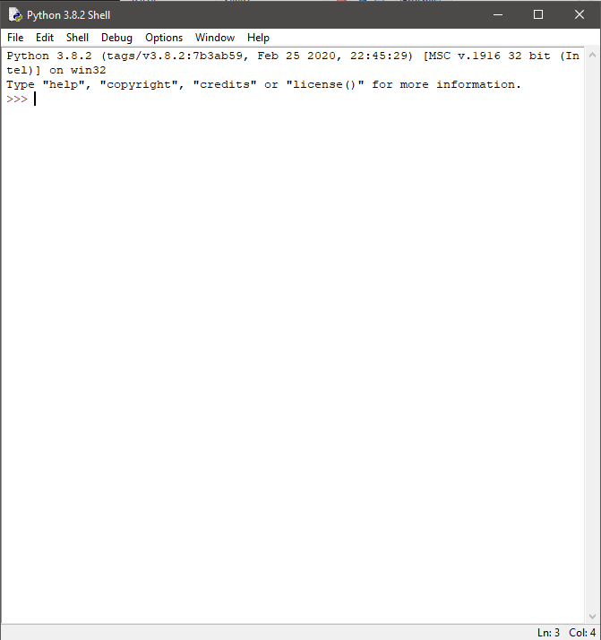
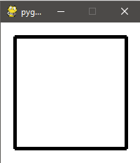
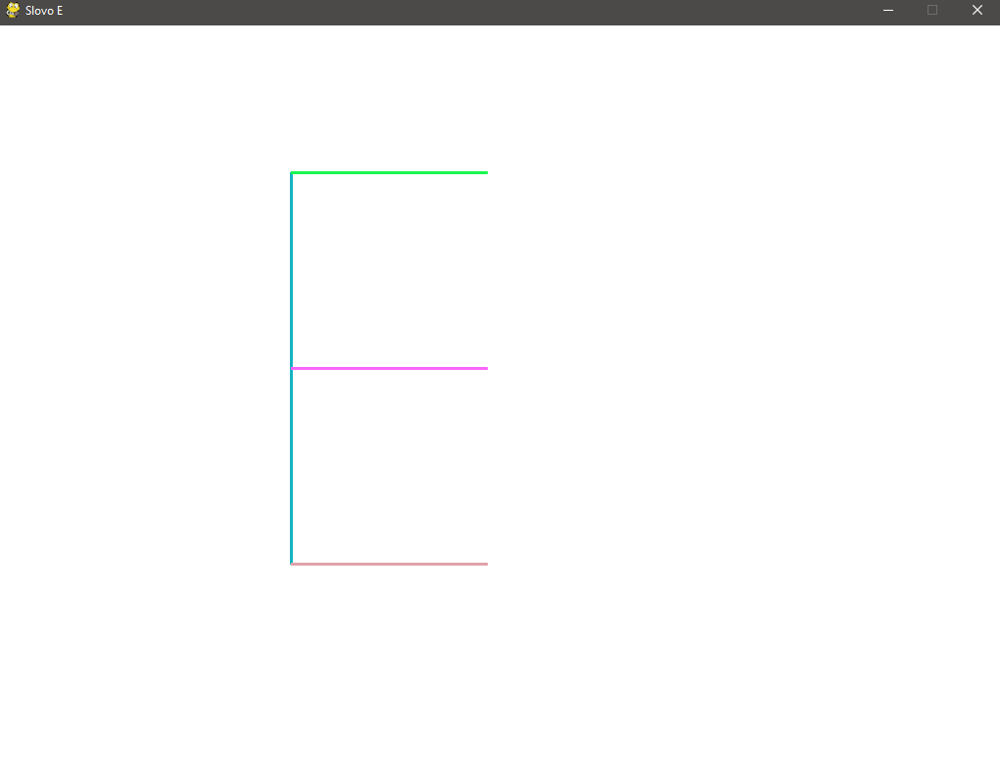

# Faza 1

***Autor: Andrija Cvetković***

---

## Čas 1

Dobrodošli na prvi čas!

Na ovom času ćete naučiti:

* Šta je pygame
* Kako se instalira python i pygame
* Kako se crta u pythonu!

---

Pre nego što nastavite, nadam se da imate *osnovno znanje iz programiranja* i da Vam je poznata `python sintaksa`. To su minimalni zahtevi za ulazak u ovaj kurs.

Dakle, da pređemo na temu ovog kursa - `pygame`.

Pygame je python biblioteka koja Vam omogućava da kreirate igrice.

Gledano na ostale biblioteke koje postoje (i za druge programske jezike), pygame se svrstava u jedne od manjih. 

**Preporučljiva je za početnike** i jedna od prednosti je činjenica da je kod koji kucate izuzetno portabilan - pygame je podržan na:

* Linux
* Windows (95, 98, ME, 2000, XP, Vista, 7, 10 
* Windows CE, BeOS, MacOS, Mac OS X, FreeBSD, NetBSD, OpenBSD, BSD/OS, Solaris, IRIX, i QNX.
* Delimično podržan za
  * AmigaOS, Dreamcast, Atari, AIX, OSF/Tru64, RISC OS, SymbianOS i OS/2

Lista je ogromna i ovo je jedan od glavnih razloga zašto hobisti koriste pygame biblioteku za razvoj igrica.

---

### Instalacija python-a i dodavanje pygame-a

Za rad sa pygame bibliotekom neophodno je python okruženje.

Kako biste proverili da li imate python na Vašem računaru, otvorite terminal na Vašem sistemu i ukucajte komandu:

```
python --version
```

ukoliko dobijete ovakav odgovor:

```
'python' is not recognized as an internal or external command, operable program or batch file.
```

nemate python i potrebno ga je instalirati.

Možete ga skinuti sa ovog [linka](https://www.python.org/downloads/).

Proces instalacije je jednostavan i, za potrebe ovog kursa, predlaže se pridržavanje podrazumevanim opcijama instalacionog procesa (ili, jednostavno rečeno, pritiskajte `next` dok ne dođete do kraja).

Nakon instalacije, ponovnim pozivom komande `python --version` bi trebalo da dobijete ovakav odgovor:

```
Python 3.8.2
``` 

Broj može da varira u zavisnosti od aktuelne verzije u trenutku instaliranja.

Instaliranjem, na ovaj način, dobijate i `IDLE` okruženje za kucanje Vašeg python koda. Ovo okruženje je zapravo program koji sada možete naći u listi programa na Vašem računaru (njegovo puno ime u trenutku izrade kursa je `IDLE (Python 3.8 32-bit)`).

Ovo okruženje izgleda ovako:



Nakon ovoga, možemo da dodamo i pygame biblioteku.

Pygame dodajete u Vaš sistem kucanjem sledeće komande, u terminal:

```
pip3 install pygame
```

ili, **ukoliko Vam sistem javi da nemate pip3**:

```
py -3 -m pip install pygame
```

Nakon što se proces instalacije završi, vreme je da proverimo ispravnost ove biblioteke!

Iskopirajte sledeći kod:

```python
import pygame
pygame.init()
prozor = pygame.display.set_mode((200, 200))
prozor.fill(pygame.Color("white"))
pygame.draw.rect(prozor, pygame.Color("black"), (20, 20, 160, 160), 5)
pygame.display.update()
pygame.time.wait(3000)
pygame.quit()
```

* otvorite `IDLE` 
* odaberite karticu `File` iz trake na vrhu
* kliknite na `New File`
* nalepite kod u prozor koji se otvorio
* odaberite karticu `Run` iz trake tog prozora
* kliknite na `Run Module`
* sačuvajte fajl na proizvoljno mesto, nije bitno kako ga imenujete

Trebalo bi da dobijete:



I ovaj prozor se zatvara 3 sekunde nakon otvaranja.

Ovime smo potvrdili ispravnost pygame-a.

---

### PygameBg

Tim Petlje je kreirao biblioteku `Pygame Toolbox for Beginners` - `PygameBg` koja automatizuje proces podešavanja otvaranja i zatvaranja prozora.

Instalira se komandom:

```
pip3 install pygamebg
```

ili

```
py -3 -m pip install pygamebg
```

Funkcije kojima se odlikuje su:

```python
pygamebg.open_window(200, 300, "PyGameBg")
```

i

```python
pygamebg.wait_loop()
```

Cela svrha ove biblioteke je da jednom linijom otvorite i jednom linijom zatvorite prozor igrice.

Kroz kurs ćemo koristiti ovu biblioteku samo u primerima, ne i u igrici.

#### Šta PygameBg automatizuje

```python
# rečju 'as' definišemo tzv. alias za ono što importujemo
# na ovaj način u kodu možemo kucati 'pg' umesto punog imena 'pygame'
# što ubrzava naš rad
import pygame as pg

######################### POČETAK PROGRAMA #########################
# inicijalizacija pygame biblioteke, obavezno!!!
pg.init()

# postavljanje naslova prozora
pg.display.set_caption("Pygame")

# nije loše odvajati konstante u posebne objekte
# na taj način ih možemo koristiti na više mesta u kodu
(width, length) = (1024, 768)

# otvaranje prozora
window = pg.display.set_mode((width, length))

######################### VAŠ PROIZVOLJNI KOD #########################

# praksa je bojiti pozadinu prozora na početku
# ova linija nije neophodna
window.fill(pg.Color("white"))

######################### KRAJ PROGRAMA #########################

# neophodno je ažurirati prikaz kako bi se nacrtali elementi
# kasnije ćemo naučiti da je ovo jedan od najbitnijih koraka
pg.display.update()

# čekanje od 2 sekunde tj. 2000 milisekundi kako se prozor ne bi odmah ugasio
pg.time.wait(5000)

# isključivanje pygame biblioteke, obavezno!!!
pg.quit()
```

Jasno je da korišćenjem PygameBg biblioteke olakšavate svoj posao, ali ujedno i nemate potpunu kontrolu nad svojom igricom.

Važno je (i veoma korisno) poznavati ove osnove pygame-a. 

---

## Koordinatni sistem

Koordinatni sistem u pygame-u funkcioniše na sledeći način:

* Tačka (0, 0) se nalazi u gornjem levom uglu.
* X raste udesno
* Y raste nadole
* Negativne koordinate ne postoje


---

## Sistem boja u pygame-u

Boje u pygame-u koristimo pozivom `pygame.Color` objekta.

Dostupno je nekoliko načina zadavanja boja ovom objetku.

1. Prosleđivanjem naziva boje u vidu string-a. Npr. `pygame.Color('blue')`. Neke od predefinisanih boja u pygame-u:

     * white
     * blue
     * green
     * red
     * black
     * orange
     * yellow
     * marroon
     * lime
     * pink
     * purple
     * gray
     * magenta
     * brown
     * ...

1. Zadavanjem RGB/RGBA vrednosti. Npr. `pygame.Color(255, 255, 0)` je 
   žuta boja, dok je `pygame.Color(255, 255, 0, 0.5)` bledo-žuta boja, tačno na sredini između transparentne i pune žute.

---

## Crtanje duži

Duž AB se u pygame-u crta pozivom funkcije

```python
pygame.draw.line(prozor, boja, temeA, temeB, debljina)
```

U pygame-u možete imati više prozora u istoj igrici, iz tog razloga je neophodno proslediti `prozor` kao prvi parametar ovoj funkciji.

***Vaš zadatak je da se poigrate ovom funkcijom i nacrtate prvo slovo Vašeg imena. Ukoliko slovo ima obline, i nije ga moguće nacrtati samo dužima, izaberite slovo koje ispunjava taj uslov i njega nacrtajte.***

_Naše rešenje možete naći u `examples` folderu ovog časa_



---

## Crtanje oblika

### Krug

```python
pygame.draw.circle(prozor, boja, koordinateCentra, poluprečnik)
```

### Kvadrat/pravougaonik

```python
pygame.draw.rect(prozor, boja, gornjeLevoTemeSirinaVisina, debljinaOkvira)
# gornjeLevoTemeSirinaVisina je uređena četvorka
# npr. (100, 100, 50, 30) će definisati pravougaonik
# čije je gornje levo teme u tački (100, 100)
# širine 50px i visine 30px

# debljinaOkvira je opciona, ukoliko se ne prosledi, jednaka je nuli
```

### Elipsa

```python
pygame.draw.ellipse(prozor, boja, gornjeLevoTemeSirinaVisina, debljinaOkvira)
# gornjeLevoTemeSirinaVisina je uređena četvorka
# npr. (100, 100, 50, 30) će definisati pravougaonik
# koji opisuje elipsu
# čije je gornje levo teme u tački (100, 100)
# širine 50px i visine 30px

# debljinaOkvira je opciona, ukoliko se ne prosledi, jednaka je nuli
```

### Mnogougao (poligon)

```python
pygame.draw.polygon(prozor, boja, listaTemena, debljinaOkvira)

# listaTemena je lista uređenih parova tačaka
# npr. listaTemena = [(50, 300), (50, 150), (150, 50), (250, 150), (250, 300)]

# debljinaOkvira je opciona, ukoliko se ne prosledi, jednaka je nuli
```

### Luk

```python
pygame.draw.arc(prozor, boja, gornjeLevoTemeSirinaVisina, odUgao, doUgao, debljina)

# luk možemo gledati kao isečak elipse
```

Primer lukova:

```python
# import math na početku programa

pygame.draw.arc(window, pygame.Color('black'), [80, 10, 250, 200], math.pi/2, math.pi, 2)
pygame.draw.arc(window, pygame.Color('black'), [80, 10, 250, 200], 0, math.pi/2, 2)
pygame.draw.arc(window, pygame.Color('black'), [80, 10, 250, 200], 3*math.pi/2, 2*math.pi, 2)
pygame.draw.arc(window, pygame.Color('black'), [80, 10, 250, 200], math.pi, 3*math.pi/2, 2)

# dobićemo punu elipsu čije je gornje levo teme
# pravougaonika koji je okružuje
# u tački (80, 100)
```

--- 

## Prikaz slika

```python
# u ovom slučaju bi slika 'image.png'
# bila u istom direktorijumu kao i fajl sa kodom
# u suprotnom, neophodno je proslediti tačnu putanju do slike
image = pg.image.load("image.png")

# prikaz slike u gornjem levom uglu prozora
window.blit(image, (0, 0))
```

Način iznad neće promeniti veličinu slike.

Ukoliko želite da manipulišete i njenom veličinom, pygame ima funkciju:

```python
# skalira prosleđenu sliku u prosleđene dimenzije
image = pygame.transform.scale(image, (width, height))
```

---

## Prikaz teksta

```python
font = pygame.font.SysFont("Open Sans", 14)

# slova se 'stavljaju na podlogu'
# drugi parametar je uključivanje antialiasing-a
textSurface = font.render("Zdravo!", True, pygame.Color("black"))

# dodaje se kao i slika
prozor.blit(textSurface, (0, 0))
```

---


***Vaš zadatak je da, pomoću svega što ste naučili na ovom času, nacrtate Čiča Glišu sa pozadinskom slikom po želji i potpišete se na dnu.***


