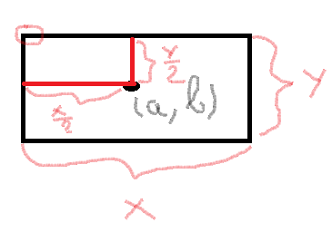
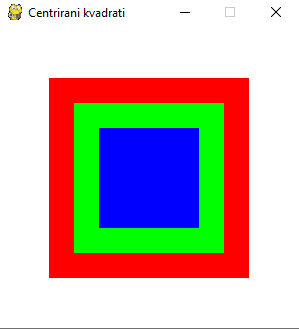
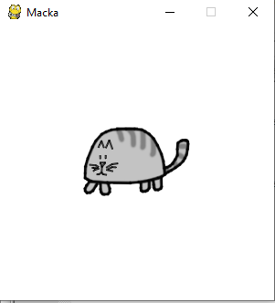
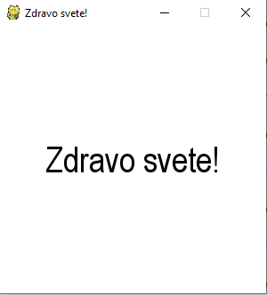
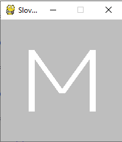
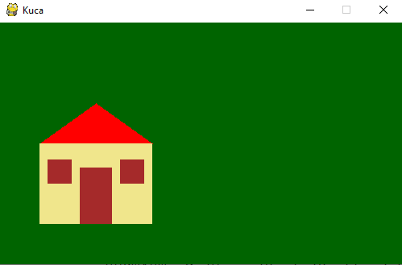
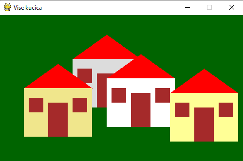
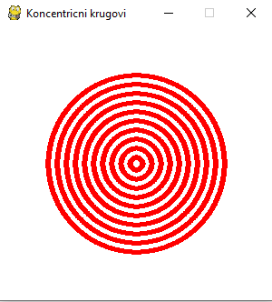
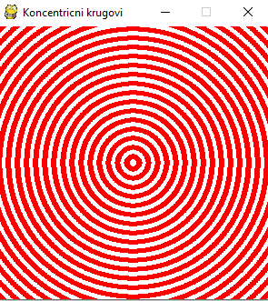
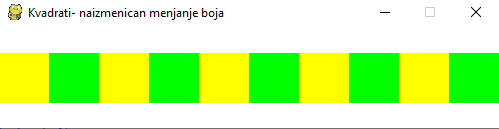

# Faza 1

***Autor: Đorđe Marinković***

---

## Čas 2

Dobrodošli na drugi čas!

Na ovom času ćete naučiti:

- Kako centrirati objekte u prozoru
- Apsolutne i relativne koordinate
- Iscrtavanje objekata pomoću petlje u pygame-u
- Grananja u pygame-u

---

### Kako centrirati objekte u prozoru

U pygame-u možemo centrirati pravougaonike, elipse, slike i tekst.

- Centriranje pravougaonika i elipsa

(Podsetimo se) Da bi nacratali pravougaonike i elipse u pygame-u koristimo sledeće naredbe:

```python
pg.draw.rect(window, color, (x, y, a, b))
```

```python
pg.draw.ellipse(window, color, (x, y, a, b))
```

obe naredbe imaju po 3 parametra.
Prva dva parametra su prozor u kome iscrtavamo i boja, dok se treći parametar sastoji od četiri cifara, gde su prve dve
cifre koordinate gornjeg levog ugla pravougaonika ili elipse koju iscrtavamo, a druge dve cifre veličine istog.

U nekim slučajevima nećemo imati koordinate gornjeg levog temena pravougaonika već koordinate centra pravougaonika odnosno
elipse. U tom slučaju ćemo koordinate gornjeg levog ugla računati pomoću formule:

```python
pg.draw.ellipse(window, color, (a - x/2, b - y/2, x, y))
```

gde su nam x i y koordinate centra



#### Primer:

Iscrtavanje tri kvadrata stranica 200, 150 i 100 piksela koji su centrirani u prozoru dimenzija 300x300 piksela.



Kod:

```python
import pygame as pg
import pygamebg

# otvaramo prozor
(width, height) = (300, 300)
window = pygamebg.open_window(width, height, "Centrirani kvadrati")

window.fill(pg.Color("white"))
# crveni kvadrat
pg.draw.rect(window, pg.Color("red"),(50, 50, 200, 200))
# zeleni kvadrat
pg.draw.rect(window, pg.Color("green"),(75, 75, 150, 150))
# plavi kvadrat
pg.draw.rect(window, pg.Color("blue"),(100, 100, 100, 100))

# prikazujemo prozor i čekamo da ga korisnik isključi
pygamebg.wait_loop()
```

- Centriranje slike

Pošto su slike pravougaonog oblika, one se takođe mogu centrirati unutar prozora na isti način
kao i bilo koji drugi pravougaonik.

Naredba za učitavanje slike iz datoteke je:

```python
image = pg.image.load("macka.png")
```

Da bi se slika centrirala, moramo znati njene koordinate. To možemo uraditi pomoću funkcija
`get_width()` i `get_height()`, koje vraćaju širinu i visinu slike. Koordinate se onda dobijaju kao polovina razlike između dimenzije ekrana i dimenzije slike.

```python
(x, y) = ((width - image.get_width()) / 2, (height - image.get_height()) / 2)
window.blit(image, (x, y))
```

#### Primer:



Kod:

```python
import pygame as pg
import pygamebg


(width, height) = (300, 300)   # otvaramo prozor
width = pygamebg.open_window(width, height, "Macka")

# bojimo pozadinu u belo
width.fill(pg.Color("white"))

# učitavamo slicicu iz datoteke macka.png
image = pg.image.load("macka.png")
# prikazujemo sličicu na sredini ekrana
(x, y) = ((width - image.get_width()) / 2, (visina - image.get_height()) / 2)
prozor.blit(image, (x, y))

# prikazujemo prozor i čekamo da ga korisnik isključi
pygamebg.wait_loop()


```

- Centriranje teksta

Za centriranje teksa kao i za sliku nam je potrebno odrediti širinu i visinu teksa. Za to možemo koristiti funkcije `get_width()` i `get_height()` kao i kod slika,
a možemo upotrebiti i funkciju `font.size()` čiji je parametar niska čija se veličina određuje.
Koordinate levog ugla se određuju na isti način kao i u slučaju slike.

```python
(x, y) = ((width - image.get_width()) / 2, (height - image.get_height()) / 2)
```

#### Primer:



Kod:

```python
import pygame as pg
import pygamebg

(width, height) = (300, 300) # otvaramo prozor
window = pygamebg.open_window(width, height, "Zdravo svete!")

# bojimo pozadinu prozora u belo
window.fill(pg.Color("white"))

# font kojim će biti prikazan tekst
font = pg.font.SysFont("Arial", 40)
# poruka koja će se ispisivati
message = "Zdravo svete!"
# gradimo sličicu koja predstavlja tu poruku ispisanu crnom bojom
tekst = font.render(message, True, pg.Color("black"))
# određujemo veličinu tog teksta (da bismo mogli da ga centriramo)
(text_width, text_height) = (tekst.get_width(), tekst.get_height())
# položaj određujemo tako da tekst bude centriran
(x, y) = ((width - tekst.get_width()) / 2, (height - tekst.get_height()) / 2)
# prikazujemo sličicu na odgovarajućem mestu na ekranu
window.blit(tekst, (x, y))

# prikazujemo prozor i čekamo da ga korisnik isključi
pygamebg.wait_loop()
```

---

### Apsolutne i relativne koordinate

- Apsolutne koordinate

Apsolutne koordinate predstavljaju unošenje konkretnih koordinata krajnjih tačaka duži koju ćete nacrtati, na primer, parove vrednosti (3,2) i (6,9). Apsolutne koordinate se mere od tačke (0,0).

#### Primer:

Iscrtavanje slova M korišćenjem apsolutnih koordinata.



Kod:

```python
# otvaramo prozor
(width, height) = (200, 200)
window = pygamebg.open_window(width, height, "Slovo M")

# bojimo pozadinu prozora u sivo
window.fill(pg.Color("grey"))

# debljina linije
lineWidth = 10

# horizontalne koordinate tačaka
left = 50
middleX = 100
right = 150

# vertikalne koordinate tačaka
up = 50
middleY = 120
down = 150

# leva vertikalna linija
pg.draw.line(window, pg.Color("white"), (left, up), (left, down), lineWidth)
# kosa linija
pg.draw.line(window, pg.Color("white"), (left, up), (middleX, middleY), lineWidth)
# kosa linija
pg.draw.line(window, pg.Color("white"), (right, up), (middleX, middleY), lineWidth)
# desna vertikalna linija
pg.draw.line(window, pg.Color("white"), (right, up), (right, down), lineWidth)

# prikazujemo prozor i čekamo da ga korisnik isključi
pygamebg.wait_loop()
```

- Relativne koordinate

Relativne koordinate predstavljaju udaljenost po osi X odnosno po osi Y, od prethodne tačke. Zovu se relativne jer imaju smisla samo u odnosu na prethodno odabranu tačku.

Tačka na osnovu koje izračunavamo ostale tačke zovemo glavna tačka ili sidro (engl. anchor).

Relativne koordinate će nam omogućiti da crtež pomeramo samo izmenama koordinata glavne tačke i da ga skaliramo samo promenom dimenzije.

#### Primer:

Jednostavno pomeranje kućice u odnosu na galvnu tacku(sidro) `(x, y) = (50, 150)`.

Slika:



Kod:

```python
import pygame as pg

# uključivanje rada biblioteke pygame
pg.init()
# podešavamo naslov prozora
pg.display.set_caption("Kuca")
# otvaramo prozor dimenzije 500x300
(width, height) = (500, 300)
window = pg.display.set_mode((width, height))

# bojimo pozadinu ekrana u tamno zeleno
window.fill(pg.Color("darkgreen"))

def house(x, y, boja_zidova):
   # krov
   pg.draw.polygon(window, pg.Color("red"), [(x, y), (x+70, y-50), (x+140, y)])
   # kuca
   pg.draw.rect(window, boja_zidova,       (x,       y,     140, 100))
   # levi prozor
   pg.draw.rect(window, pg.Color("brown"), (x + 10, y + 20,  30,  30))
   # desni prozor
   pg.draw.rect(window, pg.Color("brown"), (x + 100, y + 20, 30, 30))
   # vrata
   pg.draw.rect(window, pg.Color("brown"), (x + 50, y + 30, 40, 70))

house(50, 150, pg.Color("khaki"))
pg.display.update()   # prikazujemo nacrtano na ekranu

# petlja obrade događaja - čekamo dok korisnik ne isključi prozor
while pg.event.wait().type != pg.QUIT:
   pass

# isključivanje rada biblioteke pygame
pg.quit()
```

Poziv funckije `house(50, 150, pg.Color("khaki"))` zameniti sa sledeće četiri i pokrenuti program da bi dobili sledeću sliku.

```python
house(150,  90, pg.Color(220, 220, 220))
house(220, 130, pg.Color("white"))
house(350, 160, (255, 255, 150))
house( 50, 150, pg.Color("khaki"))
```

Slika:



---

## Iscrtavanje objekata pomoću petlje u pygame-u

U pygame-u postoje dve vrste petlji:

- for petlja
- while petlja

### For petlja

Fot petlju koristimo kada znamo da će se odrećena naredba ponavljati određeni broj puta.

Naredba for petlje u pygame-u:

```
for i in range(start, end, step):
    ...
```

- start - početna vrednost od koje krećemo
- end - vrednost do koje idemo, uvek stavljamo za jedan vuću da ti obuhvatili i željenu vrednost
- step - vrednost za koliko će se nasa početna vrednost uvećavati

For petlja će nam skratiti vreme pisanja koda gde iscrtavamo objekte koji se ponavljaju.

#### Primer:

Iscrtavanje koncentričnih krugova korišćenjem for petlje



Kod:

```python
import pygame as pg
import pygamebg

(width, height) = (300, 300) # otvaramo prozor
window = pygamebg.open_window(width, height, "Koncentricni krugovi")

# bojimo pozadinu prozora u belo
window.fill(pg.Color("white"))

# centar kruga je u centru prozora - obrati pažnju na tip podataka
center = (width // 2, height // 2)

# poluprečnik se menja od 10 do 100, sa korakom 10
for r in range(10, 101, 10):
    # crtamo krug
    pg.draw.circle(window, pg.Color("red"), center, r, 5)

# prikazujemo prozor i čekamo da ga korisnik isključi
pygamebg.wait_loop()
```

### While petlja

While petlju koristimo kada ne znamo tačan broj ponavljanja izvršenja neke naredbe. While petlja će se izvršavati sve dok je uslov u njoj zadovoljen.

Naredba while petlje u pygame-u:

```python
while uslov:
	naredba
    ...
```

#### Primer:

Crtanje koncentričnih krugova koristeći while petlju

Slika:



Kod:

```python
import pygame as pg
import pygamebg

(width, height) = (300, 300) # otvaramo prozor
window = pygamebg.open_window(width, height, "Koncentricni krugovi")

# bojimo pozadinu prozora u belo
window.fill(pg.Color("white"))

# centar kruga je u centru prozora - obrati pažnju na tip podataka
center = (width // 2, height // 2)

# vrednost poluprecnika
r = 10

# while petlja ce se izvrsavati sve dok je poluprecnik manji od sirine stranice prozora
while r < width:
    # crtamo krug
    pg.draw.circle(window, pg.Color("red"), center, r, 5)
    # korak u kome povecavamo poluprecnik za odredjenu vrednost
    r=r+10

# prikazujemo prozor i čekamo da ga korisnik isključi
pygamebg.wait_loop()
```

## Grananja u pygame-u

Grananje, tj. uslovno izvršenje naredbi, postižemo pomogu naredbe if-else.

```python
if uslov:
	uslov_ispunjen
else:
	uslov_nije_ispunjen
```

#### Primer:

Iscrtavanje kvadrata naizmeničnih boja

Slika:



Kod:

```python
import pygame as pg
import pygamebg

(width, height) = (500, 100) # otvaramo prozor
window = pygamebg.open_window(width, height, "Kvadrati- naizmenican menjanje boja")

# bojimo pozadinu prozora u belo
window.fill(pg.Color("white"))
# broj kvadrata koje treba iscrtati
numberOfSquares = 10
# širina i visina jednog kvadrata
squareDimension = width / numberOfSquares
# vertikalna sredina ekrana
middle = height / 2

for i in range(0, numberOfSquares):
    # boja zavisi od toga da li je redni broj kvadrata paran ili neparan
    if i % 2 ==0:
        color = pg.Color("yellow")
    else:
        color = pg.Color("green")
    # koordinate gornjeg levog temena
    (left, up) = (i * squareDimension, middle - squareDimension / 2)
    # crtamo kvadrat
    pg.draw.rect(window, color, (left, up, squareDimension, squareDimension))

# prikazujemo prozor i čekamo da ga korisnik isključi
pygamebg.wait_loop()
```
