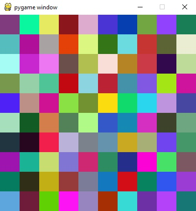
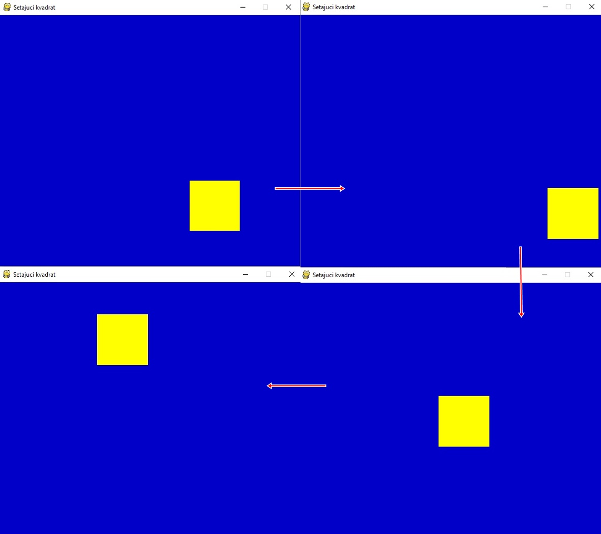
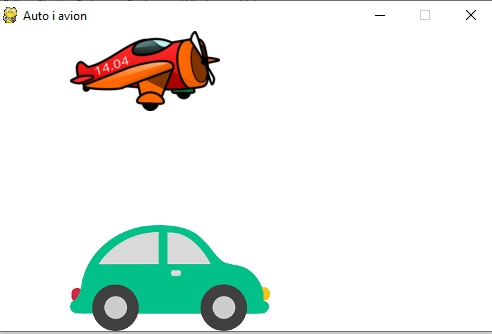

# Faza 1

## Čas 3

Dobrodošli na treći čas!

Na ovom času ćete naučiti:

- Šta je animacije
- Kako se animacije kreiraju u pygame-u

---

**Animacije** podrazumevaju brzu promenu slike na ekranu, gde se svaka naredna razlikuje u nekom detalju od prethodne pa nam se kroz tu promenu čini da se ta slika kreće. Svaka od slika koje čine animaciju se naziva `frejm (eng. frame)`.

Na ovom času ćemo naučiti kako da kreiramo program u kom se prikazuju animacije.

---

### Kreiranje naše prve animacije u python-u

Neka naša prva animacija bude podijum za igru u diskoteci. Iscrtaćemo mrežu kvadrata koji će, na unapred određeno vreme, menjati svoju boju u neku naizmeničnu.

- otvorite `IDLE`
- odaberite karticu `File` iz trake na vrhu
- kliknite na `New File`

```python
import pygame as pg
import pygamebg
import random

# inicijalizacija prozora
(sirina, visina) = (400, 400)
pg.init()
prozor = pg.display.set_mode((sirina, visina))
prozor.fill(pg.Color("white"))

# određivanje broja kvadrata po kolonama i njihova veličina
broj_kvadrata = 10
a = sirina / broj_kvadrata

# funkcija koja će generisati neku boju u RGB obliku
def nasumicna_boja():
    return(random.randint(0, 255), random.randint(0, 255), random.randint(0, 255))

# funkcija koja iscrtava mrežu kvadrata nasumičnih boja
def crtaj():
    for i in range(broj_kvadrata):
        for j in range(broj_kvadrata):
            pg.draw.rect(prozor, nasumicna_boja(), (j*a, i*a, a, a))

# funkciju crtaj ćemo pozivati svake sekunde pa će se tako menjati boja kvadrata
pygamebg.frame_loop(1, crtaj)
```

- odaberite karticu `Run` iz trake tog prozora
- kliknite na `Run Module`
- sačuvajte fajl, imenujte ga po želji

Trebalo bi da dobijete:



_Pri svakom pokretanju kombinacija boja je drugačija, zašto?_

---

### Šetajući kvadrat

U ovom primeru ćemo prikazati šta se dešava _iza zavesa_ kad čujemo da se stalno iscrtavaju novi objekti a pritom stari brišu i tako stiče doživljaj šetanja oblika po prozoru.

U ovom primeru ćemo non-stop iscrtavati žuti kvadrat koji će menjati svoje pozicije za unapred zadat pomeraj i tako simulirati njegovo kretanje po prozoru programa.

- Kreirajte nov fajl
- Iskopirajte sledeći kod:

```python
import pygame, sys
from pygame.locals import *

# inicijalizujmo prozor
pygame.init()
(sirina, visina) = (600, 500)
ekran = pygame.display.set_mode((sirina, visina))
pygame.display.set_caption("Setajući kvadrat")
zuta = 255,255,0

# definisimo kvadrat i njegove pozicije
stranica_kvadrata = 100
debljina_linije = 0 # popunjeno skroz
x_pozicija = 300
y_pozicija = 250
x_brzina = 0.5
y_brzina = 0.5

while True: # ovaj deo koda će se non-stop izvršavati i tako simuliramo animaciju
    for dogadjaj in pygame.event.get():
        if dogadjaj.type in (QUIT, KEYDOWN):
            sys.exit()
    ekran.fill((0,0,200))

    # pomeramo kvadrat
    x_pozicija += x_brzina
    y_pozicija += y_brzina

    # zadržavamo kvadrat unutar prozora
    if x_pozicija > sirina - stranica_kvadrata or x_pozicija < 0:
        x_brzina = -x_brzina
    if y_pozicija > visina - stranica_kvadrata or y_pozicija < 0:
        y_brzina = -y_brzina

    # crtanje kvadrata
    pos = x_pozicija, y_pozicija, stranica_kvadrata, stranica_kvadrata
    pygame.draw.rect(ekran, zuta, pos, debljina_linije)
    pygame.display.update()
```

Trebalo bi da dobijete:



---

### Animacija slika koje se kreću

Često nam za animaciju neće biti dovoljan samo neki geometrijski crtež, pa se tako javila i potreba za ubacivanjem nekih crteža koji se kreću. Takođe, ovde ćemo pokrenuti više različitih objekata.

U sledećem primeru ćemo prikazati kako to da uradimo:

- Sam početak projekta je identičan kao u prethodnim primerima
- Nakon toga kopirajte sledeći kod:

  ```python
    import math
    import pygame as pg
    import pygamebg

    (sirina, visina) = (500, 300)  # otvaramo prozor
    prozor = pygamebg.open_window(sirina, visina, "Auto i avion")

    avion_slika = pg.image.load("images/avion.png")
    # avion se pojavljuje u gornjem levom uglu
    (avion_x, avion_y) = (0, 0)

    auto_slika = pg.image.load("images/auto.png")
    # auto se pojavljuje u donjem levom uglu
    (auto_x, auto_y) = (0, visina - auto_slika.get_height())

    def crtaj():
        prozor.fill(pg.Color("white"))
        # crtamo avion
        prozor.blit(avion_slika, (avion_x, avion_y))
        # crtamo auto
        prozor.blit(auto_slika, (auto_x, auto_y))

    def novi_frejm():
        global avion_x, avion_y, auto_x, auto_y

        # pomeramo avion
        avion_x += 2
        if avion_x > sirina:
            avion_x = - avion_slika.get_width()

        # pomeramo auto
        auto_x += 2
        if auto_x > sirina:
            auto_x = - auto_slika.get_width()

        crtaj()

    pygamebg.frame_loop(100, novi_frejm)
  ```

  Trebalo bi da dobijete:

## 

---

**_Vaš zadatak je da, na osnovu znanja stečenog na ovom i prethodna dva časa, kreirate malu 'igricu'. Dovoljno je da nacrtate neki originalan oblik (korišćenjem pygame funkcija za crtanje) i animirate ga. P.S. da bi 'igrica' delovala bogatije, dodajte i neku pozadinsku sliku i potpišite se kao autor na dnu :)._**
