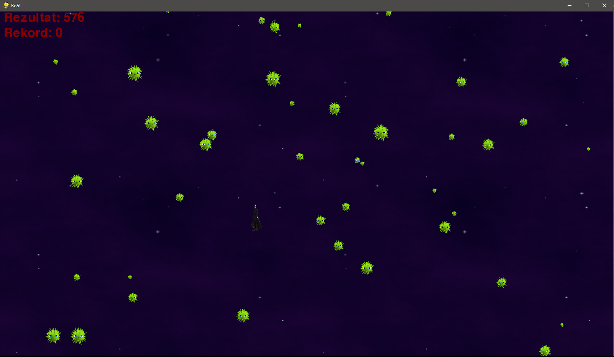
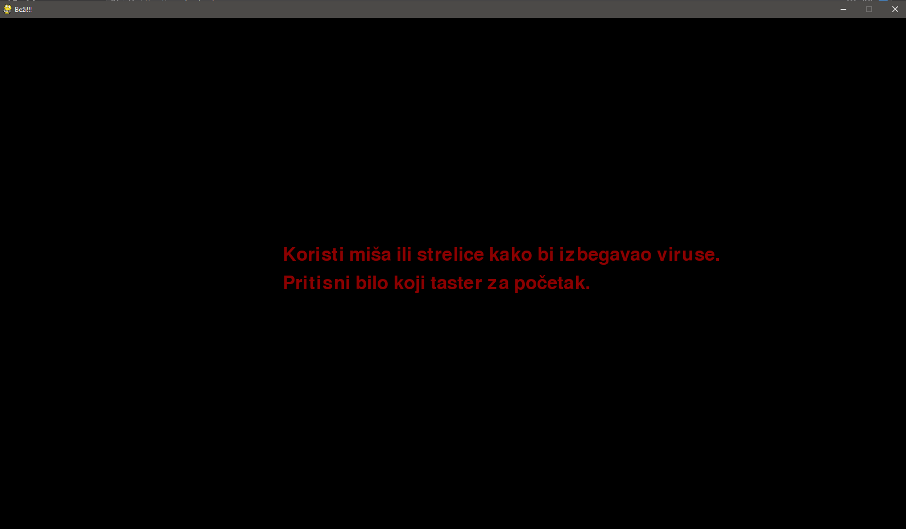
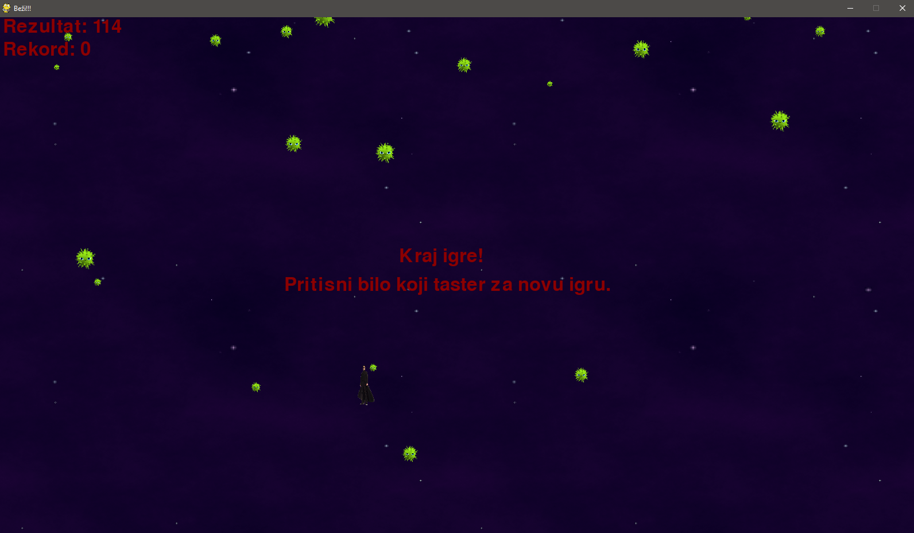
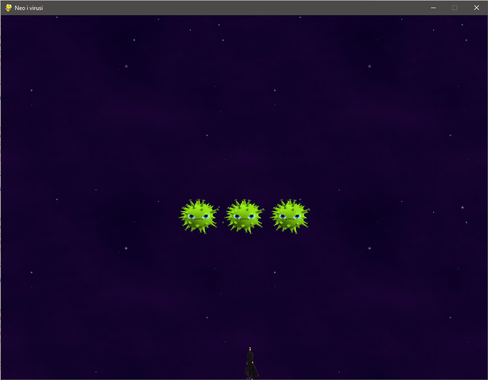
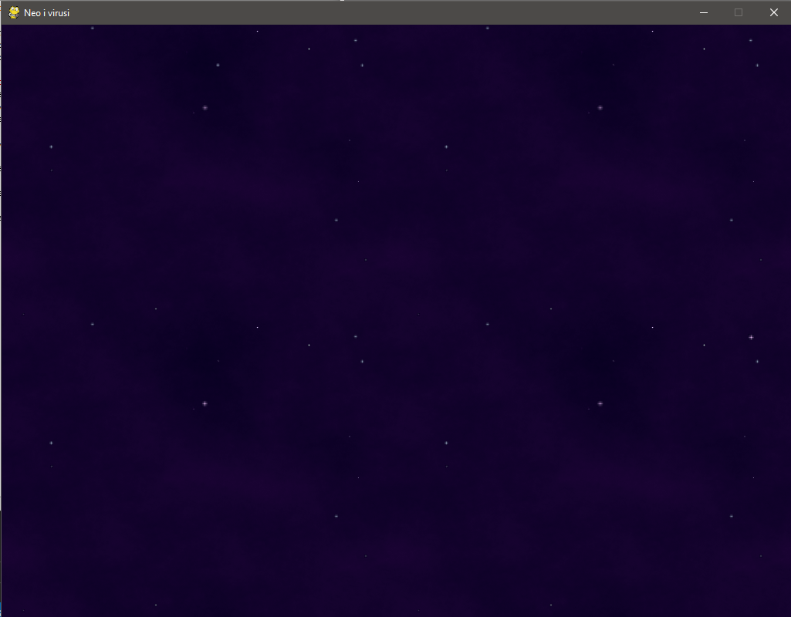
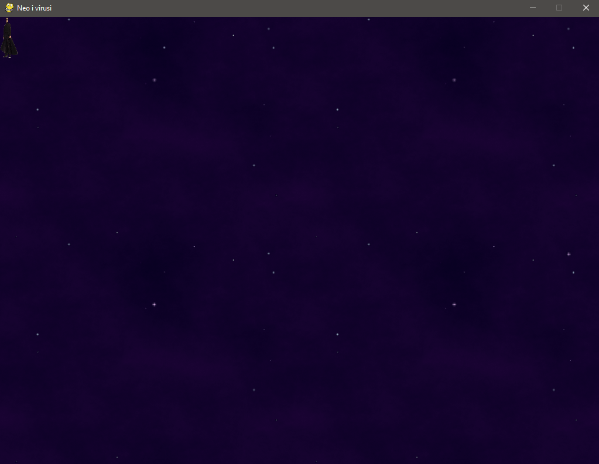
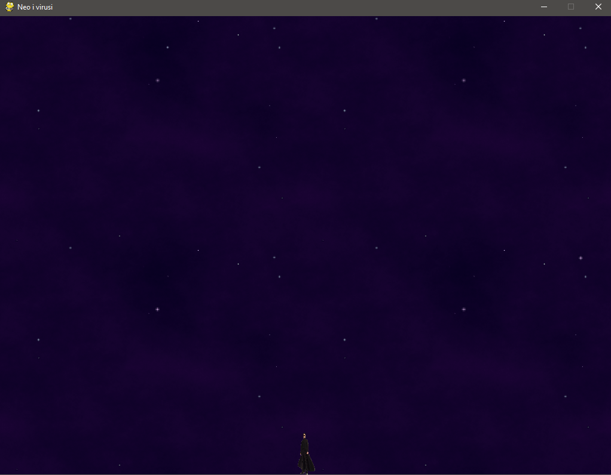
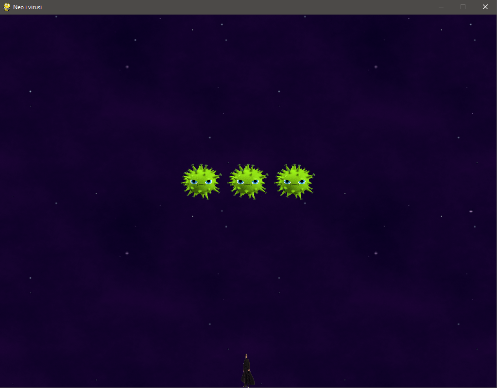

# Faza 2

## Čas 1

Dobrodošli na prvi čas druge faze!

Na ovom času ćete naučiti:

- Specifikacije igrice koju ćemo kreirati
- Pravila (inženjerska i dizajnerska) kreiranja igrice
- Kako da postavite osnovu igrice

---

Igrica koju ćemo kreirati izgledaće ovako:



### Specifikacija igrice

Opis igrice:

U pitanju je igrica izbegavanja padajućih objekata.

- Mesto radnje: svemir

- Padajući objekti: virusi

- Karakter igrača: Neo (iz Matrix trilogije)

Igrica, nakon pokretanja, prikazuje igraču uputstvo za igranje i čeka da igrač potvrdi da je spreman za igru.



Igrač kontroliše svog karaktera pomoću strelica na tastaturi, pomoću W, A, S i D tastera a ima i mogućnost kontrolisanja mišem (pomeranjem miša po prozoru se pomera i karakter).

Sa vrha prozora "padaju" objekti (virusi) različitih veličina i kreću se različitim brzinama.

Igra je izgubljena onog trenutka kad karakter dodirne neki objekat. Igrica, u suprotnom, nema kraja.



U pozadini se pokreće tajmer (odmah nakon početka igranja) i, na osnovu njega, broji rezultat.

Igrica pamti rekordni rezultat (ali samo dok se sam prozor ne zatvori).

U pozadini se čuje motivaciona melodija.

Bonus:

- Igrač može da uspori sve padajuće objekte i tako ih lakše izbegne (ali mu se rezultat resetuje na 0)
- Igrač može da natera viruse da promene smer kretanja (ali mu se rezultat resetuje na 0)

Igrica se može isključiti klikom na taster `ESC`.

---

### Pravila (inženjerska i dizajnerska) kreiranja igrice

Pre nego počnemo sa implementacijom, neophodno je da znamo neke od osnova, kako inženjerskih, tako i dizajnerskih.

#### Krenimo od lakših, dizajnerskih:

Prvo pitanje koje se postavlja je, kome je proizvod (igrica) namenjena?

U našem slučaju, ciljna grupa su deca pa će ideja dizajna biti osnovana na šaljivom faktoru.

Deci nije važno koliko je igrica realistična i koliko je precizna (npr. profesionalnim igračima CS:GO igrice je preciznost igrice prioritet - jasni šabloni pucanja i kretanja, ima pravila fizike u svojoj implementaciji, dok će kod nas kretanje biti nasumično/neočekivano i bez nekih strogih pravila).

Deci je dovoljno da se zabavljaju a to se može postići i najjednostavnijim dizajnom.

Od dizajna umnogome zavisi i težina igranja. U našem slučaju, efekat postižemo tamnom pozadinom i crnim karakterom (koga je malo teže pratiti po pozadini). U slučaju korišćenja kontrasti (npr. karakter svetle boje na tamnoj pozadini ili obratno) igrica postaje jednostavnija za igranje (videćemo primer).

Uz sve to, igrica i dalje može biti veoma dosadna ukoliko nema nikakve zvučne efekte. Standard je, u igricama ovakvog tipa, da postoji melodija u prozoru menija, melodija tokom igranja, kao i melodija na kraju igrice (pobednička/gubitnička).

U našem slučaju, imamo dve melodije:

- Melodija u toku igranja (nemamo klasičan početni meni)
- Melodija nakon udaranja u padajući objekat (kraj igre)

#### Inženjerska pravila

Jedno od glavnih pravila u programiranju: _kucaj kod koji će budući inženjeri razumeti!_

Ma koji god program kucali, od velike je važnosti da poštujemo pravila programiranja. Termin `nečitljiv kod` se lako prevodi: _kod koji niko ne može da pročita_, takav kod je praktično beskoristan. Mi ćemo se truditi da ne dođe do toga.

Opšte prihvaćeni principi:

- [K.I.S.S. - Keep it simple, stupid](https://en.wikipedia.org/wiki/KISS_principle)
- [D.R.Y. - Don't repeat yourself](https://en.wikipedia.org/wiki/Don%27t_repeat_yourself)
- [Y.A.G.N.I. - You ain't gonna need it](https://en.wikipedia.org/wiki/You_aren%27t_gonna_need_it)

Prevedeno:

- _Ne komplikuj, piši jednostavan kod._ Ukoliko primetite da, kod koji kucate, postaje komplikovan čak i Vama koji ga kucate, verovatno može da se pojednostavi (i bilo bi poželjno!).
- _Ne ponavljaj se._ Ukoliko isti deo koda koristite na više mesta, prebacite ga u promenljivu ili funkciju. Dobićete pregledniji kod koji se lakše održava (ako u nekom trenutku kod mora da se izmeni, promenićete ga na jednom mestu a ne svuda gde je on kopiran).
- _Neće ti biti potrebno._ Nemojte preterivati tokom programiranja. Ukoliko zahtev nije postavljen, nemojte implementirati funkcionalnost na svoju ruku. Usporavate proces razvoja, prvo ispunite zahteve pa onda, ukoliko ima dovoljno resursa, proširite program dodatnim funkcionalnostima.

---

### Kako da postavite osnovu igrice

*Nastavite s radom nakon što detaljno pročitate sadržaj iznad i sigurni ste u znanje koje ste stekli nakon čitanja.*

Nakon ovog časa, naša igrica će izgledati ovako:



**Svi neophodni resursi (slike i kod) se nalaze u folderima ovog časa**

---

#### Implementacija prozora igrice

```python
import pygame

# extract dimensions
(width, height) = (1024, 768)

background = pygame.image.load('bg.png')
# scale to desired dimensions
background = pygame.transform.scale(background, (width, height))

# initialize pygame
pygame.init()

# set window specs
windowSurface = pygame.display.set_mode((width, height))

# set window title
pygame.display.set_caption('Neo i virusi')

# add background
windowSurface.blit(background, (0, 0))

pygame.display.update()

pygame.time.wait(5000)

pygame.quit()
```

Rezultat ovog koda je:



Dobili smo prozor dimenzija 1024x768px koji se automatski ugasi nakon 5 sekundi.

Trenutno ne brinemo o načinu zatvaranja prozora i prepuštamo pygame-u da se automatski ugasi.

Obratite pažnju na dimenzije prozora, možete da postavite proizvoljne dimenzije ali je pametno da to bude manje od dimenzije Vašeg ekrana. U suprotnom, ukoliko kreirate prozor slične veličine kao i ekran, imaćete poteškoće tokom pomeranja tog prozora (ovo nije fullscreen igrica!).

Linijom

```python
(width, height) = (1024, 768)
```

smo izolovali dimenzije prozora kako bismo ih kasnije na samo jednom mestu menjali. 

---

#### Dodavanje karaktera

Ideja za dodavanje karaktera izgleda ovako:

```python
playerImage = pygame.image.load('neo.png')
playerImage = pygame.transform.scale(playerImage, (30, 70))
# Rect((left, top), (width, height))
playerRect = playerImage.get_rect()
```

Na poznat način učitavamo sliku i skaliramo njene dimenzije na željene.

Uz to, koristićemo i funkciju

```python
playerRect = playerImage.get_rect()
```

Ona vraća pravougaonik koji oivičuje, u našem slučaju, sliku.

`Rect` objekat koji smo dobili ima dva para parametara.

Prvi je par koordinata gornjeg levog temena pravougaonika.

Drugi je par dimenzija (širina x visina).

**Ovaj objekat će nam pomoći da pozicioniramo sliku na željeno mesto.**

Sliku sada možemo dodati korišćenjem:

```python
windowSurface.blit(playerImage, playerRect)
```

Na ovaj način kažemo pygame-u da želimo da, na površinu prozora, dodamo sliku na poziciju koju definiše `Rect` objekat.

Dodajmo karaktera u kod:

```python
import pygame

# extract dimensions
(width, height) = (1024, 768)

background = pygame.image.load('bg.png')
# scale to desired dimensions
background = pygame.transform.scale(background, (width, height))

# initialize pygame
pygame.init()

# set window specs
windowSurface = pygame.display.set_mode((width, height))

# set window title
pygame.display.set_caption('Neo i virusi')

# images
playerImage = pygame.image.load('neo.png')
playerImage = pygame.transform.scale(playerImage, (30, 70))
# Rect((left, top), (width, height)) -> Rect
playerRect = playerImage.get_rect()

# add background
windowSurface.blit(background, (0, 0))
# add character
windowSurface.blit(playerImage, playerRect)

pygame.display.update()

pygame.time.wait(5000)

pygame.quit()
```

Rezultat ovog koda je:



Primetimo da se karakter nalazi u gornjem levom uglu prozora, zašto?

Podrazumevani par koordinata gornjeg levog ugla `get_rect()` funkcije je (0, 0).

Promenimo ih kako bi nam se karakter na početku igrice nalazio na samom dnu prozora, u sredini po horizontali.

```python
playerRect.topleft = (int(width / 2), height - 70)
```

Pristupimo paru koordinata gornjeg levog ugla `Rect` objekta i dodelimo mu vrednosti:

- x = polovina širine prozora 
- y = visina prozora - visina karaktera

Možemo i da cepidlačimo:

- x = polovina širine prozora - polovina širine karaktera (pravi centar horizontale)
- y = visina prozora - visina karaktera


Kod sada izgleda ovako:

```python
import pygame

# extract dimensions
(width, height) = (1024, 768)

background = pygame.image.load('bg.png')
# scale to desired dimensions
background = pygame.transform.scale(background, (width, height))

# initialize pygame
pygame.init()

# set window specs
windowSurface = pygame.display.set_mode((width, height))

# set window title
pygame.display.set_caption('Neo i virusi')

# images
playerImage = pygame.image.load('neo.png')
playerImage = pygame.transform.scale(playerImage, (30, 70))
# Rect((left, top), (width, height)) -> Rect
playerRect = playerImage.get_rect()

# set up rect position
playerRect.topleft = (int(width / 2) - int(30 / 2), height - 70)

# add background
windowSurface.blit(background, (0, 0))
# add character
windowSurface.blit(playerImage, playerRect)

pygame.display.update()

pygame.time.wait(5000)

pygame.quit()
```

Primetite da, ukoliko ne naglasite `int(30 / 2)` već samo napišete `30 / 2`, u konzoli će se ispisati upozorenje:

`DeprecationWarning: an integer is required (got type float).  Implicit conversion to integers using __int__ is deprecated, and may be removed in a future version of Python.`

Rezultat ovog koda je:



Pre nego što nastavimo, primetimo grešku u poštovanju principa programiranja.

```python
playerImage = pygame.transform.scale(playerImage, (30, 70))

###

playerRect.topleft = (int(width / 2) - 30 / 2, height - 70)
```

Ukoliko bismo, iz ma kog razloga, hteli da promenimo dimenziju karaktera, morali bismo na oba mesta da menjamo brojeve. Ovo se lako previdi.

Izdvojimo dimenziju karaktera u promenljivu:

```python
playerDimensions = (30, 70)
```

i ažurirajmo potencijalno problematičan kod:

```python
playerImage = pygame.transform.scale(playerImage, playerDimensions)

###

playerRect.topleft = (int(width / 2) - int(playerDimensions(0) / 2), height - playerDimensions(1))
```

Ažurirajmo i naziv para dimenzija prozora, kako bi bilo jasnije koje dimenzije se na šta odnose.

Kod sada izgleda ovako:

```python
import pygame

# extract dimensions
(windowWidth, windowHeight) = (1024, 768)

background = pygame.image.load('bg.png')
# scale to desired dimensions
background = pygame.transform.scale(background, (windowWidth, windowHeight))

# initialize pygame
pygame.init()

# set window specs
windowSurface = pygame.display.set_mode((windowWidth, windowHeight))

# set window title
pygame.display.set_caption('Neo i virusi')

playerDimensions = (30, 70)

# images
playerImage = pygame.image.load('neo.png')
playerImage = pygame.transform.scale(playerImage, playerDimensions)
# Rect((left, top), (width, height)) -> Rect
playerRect = playerImage.get_rect()

# set up rect position
playerRect.topleft = (int(windowWidth / 2) - (playerDimensions[0] / 2), windowHeight - playerDimensions[1])

# add background
windowSurface.blit(background, (0, 0))
# add character
windowSurface.blit(playerImage, playerRect)

pygame.display.update()

pygame.time.wait(5000)

pygame.quit()
```

Rezultat ovog koda je isti kao i ranije ali su dimenzije izolovane i menjaće se na samo jednom mestu, ukoliko bude bilo potrebno.

---

#### Dodavanje padajućih objekata

Sledeći zadatak je dodavanje padajućih objekata (virusa).

Princip je isti kao i dodavanje karaktera iznad.

```python
fallingObjectDimensions = (96, 80)

fallingObjectImage = pygame.image.load('object.png')
fallingObjectImage = pygame.transform.scale(fallingObjectImage, fallingObjectDimensions)
fallingObjectRect = fallingObjectImage.get_rect()
```

Sada, međutim, želimo da dodamo 3 virusa, iznad našeg karaktera, na centru ekrana, u istoj liniji horizontalno.

Ideja je sledeća:

```python
for i in range(3):
    fallingObjectRect.topleft = (int(width / 2) - fallingObjectDimensions[1] / 2 + (i - 1) * fallingObjectDimensions[0]  - (fallingObjectDimensions[0] / 2), int(height / 2))
    windowSurface.blit(fallingObjectImage, fallingObjectRect)
```

Kod sada izgleda ovako:

```python
import pygame

# extract dimensions
(windowWidth, windowHeight) = (1024, 768)

background = pygame.image.load('bg.png')
# scale to desired dimensions
background = pygame.transform.scale(background, (windowWidth, windowHeight))

# initialize pygame
pygame.init()

# set window specs
windowSurface = pygame.display.set_mode((windowWidth, windowHeight))

# set window title
pygame.display.set_caption('Neo i virusi')

# player character
playerDimensions = (30, 70)
playerImage = pygame.image.load('neo.png')
playerImage = pygame.transform.scale(playerImage, playerDimensions)
# Rect((left, top), (width, height)) -> Rect
playerRect = playerImage.get_rect()

# set up player rect position
playerRect.topleft = (int(windowWidth / 2) - int(playerDimensions[0] / 2), windowHeight - playerDimensions[1])

# falling object
fallingObjectDimensions = (96, 80)
fallingObjectImage = pygame.image.load('object.png')
fallingObjectImage = pygame.transform.scale(fallingObjectImage, fallingObjectDimensions)
fallingObjectRect = fallingObjectImage.get_rect()

# add background
windowSurface.blit(background, (0, 0))
# add character
windowSurface.blit(playerImage, playerRect)

for i in range(3):
    fallingObjectRect.topleft = (int(windowWidth / 2) + (i - 1) * fallingObjectDimensions[0]  - int(fallingObjectDimensions[0] / 2), int(windowHeight / 2) - fallingObjectDimensions[1])
    windowSurface.blit(fallingObjectImage, fallingObjectRect)

pygame.display.update()

pygame.time.wait(5000)

pygame.quit()
```

Rezultat ovog koda je:



---

#### Zatvaranje prozora

Definišimo funkciju:

```python
def terminate():
    pygame.quit()
    sys.exit()
```

Koristićemo je za zatvaranje prozora naše igrice.

Definišimo i logiku slučaja pozivanja ove funkcije:

```python
while True:
    for event in pygame.event.get():
        if event.type == QUIT:
            terminate()

        if event.type == KEYUP:
            if event.key == K_ESCAPE:
                    terminate()
```

Neophodno je i da importujemo `sys` i `pygame.locals`.

Prvi uslov ispituje/očekuje da korisnik klikne na X dugme prozora igrice dok drugi uslov ispituje/očekuje da korisnik klikne/pusti ESC dugme na tastaturi.

Kod sada izgleda ovako:

```python
import pygame, sys
from pygame.locals import *

def terminate():
    pygame.quit()
    sys.exit()

# extract dimensions
(windowWidth, windowHeight) = (1024, 768)

background = pygame.image.load('bg.png')
# scale to desired dimensions
background = pygame.transform.scale(background, (windowWidth, windowHeight))

# initialize pygame
pygame.init()

# set window specs
windowSurface = pygame.display.set_mode((windowWidth, windowHeight))

# set window title
pygame.display.set_caption('Neo i virusi')

# player character
playerDimensions = (30, 70)
playerImage = pygame.image.load('neo.png')
playerImage = pygame.transform.scale(playerImage, playerDimensions)
# Rect((left, top), (width, height)) -> Rect
playerRect = playerImage.get_rect()

# set up player rect position
playerRect.topleft = (int(windowWidth / 2) - int(playerDimensions[0] / 2), windowHeight - playerDimensions[1])

# falling object
fallingObjectDimensions = (96, 80)
fallingObjectImage = pygame.image.load('object.png')
fallingObjectImage = pygame.transform.scale(fallingObjectImage, fallingObjectDimensions)
fallingObjectRect = fallingObjectImage.get_rect()

# add background
windowSurface.blit(background, (0, 0))
# add character
windowSurface.blit(playerImage, playerRect)

for i in range(3):
    fallingObjectRect.topleft = (int(windowWidth / 2) + (i - 1) * fallingObjectDimensions[0]  - int(fallingObjectDimensions[0] / 2), int(windowHeight / 2) - fallingObjectDimensions[1])
    windowSurface.blit(fallingObjectImage, fallingObjectRect)

pygame.display.update()

while True:
    for event in pygame.event.get():
        # click on X button of the window
        if event.type == QUIT:
            terminate()

        # release ESC keyboard button
        if event.type == KEYUP:
            if event.key == K_ESCAPE:
                    terminate()
```

Prozor igrice se sada gasi bilo klikom na X dugme prozora, bilo klikom na ESC dugme tastature.

Ovime smo uokvirili prvi čas i kreirali osnovu za igricu.
