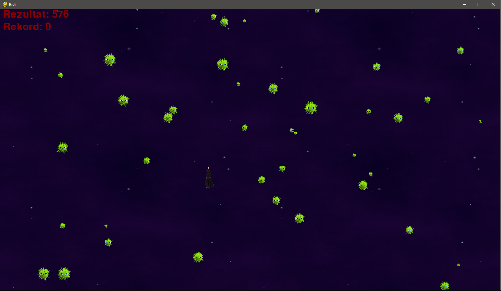
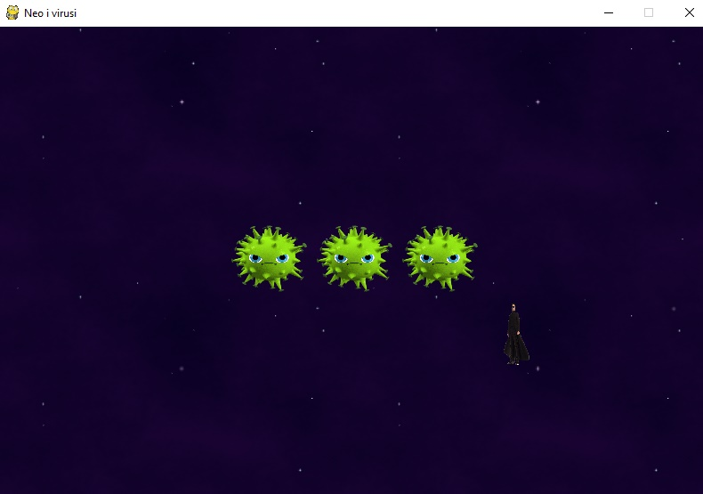

# Faza 2

***Autor: Stefan Radovanović***

---

## Čas 2

Dobrodošli na drugi čas druge faze!

Na ovom času ćete naučiti:

- Kako da pomerate junaka igrice pomoću tastera na tastaturi
- Kako da se u igrici krećete pomoću miša

---

Na prethodnom času smo videli kako treba da izgleda igrica koju pravimo i upoznali smo se sa nekim osnovnim pravilima koje trebamo napraviti.



---

### Pomeranje junaka pomoću tastature

Kako smo već na prethodnom času objasnili funkcionalnost igrice i postavili karakter igrača, sada je potrebno omogućiti mu i pomeranje po ekranu, jer u suprotnom igrica ne bi imala smisla.

Za početak ćemo dodati kretanje pomoću W, A, S i D tastera, a nakon toga i kretanje pomoću strelica.

Pre svega potrebno je odrediti koliko će se pomeriti naš junak kada mu zadamo komandu tasterom. Tako ćemo na samom početku igrice, pre inicijalizacije definisati konstante koje će se koristiti tokom cele igrice.

```python
#constants
playerMoveRate = 5
```

Na samom početku kreiranja događaja potrebno je definisati 4 logičke promenljive koje će nam pomoći da odredimo u kom pravcu i smeru će se kretati naš junak nakon određene komande.
Tako ćemo dodati sledeće logičke promenljive:

```python
while True:
    moveLeft = moveRight = moveUp = moveDown = False
```
Sada je potrebno kreirati događaje za svaki taster koji hoćemo da ima neku ulogu u igrici. Kao što smo rekli, to će biti W, A, S i D tasteri kao i strelice sa tastature.

U `while` petlji gde smo definisali logiku za zatvaranje cele igrice, dodaćemo upite gde ćemo proveravati koji taster je pritisnut i u zavisnosti od tastera promeniti vrednost tačno one logičke promeljive koja će odrediti pravac i smer kretanja.

```python
if event.type == KEYDOWN:
    # release a keyboard button
    if event.key == K_LEFT or event.key == ord('a'):
        moveLeft = True

    # release d keyboard button
    if event.key == K_RIGHT or event.key == ord('d'):
        moveRight = True
    
    # release w keyboard button
    if event.key == K_UP or event.key == ord('w'):
        moveUp = True
    
    # release s keyboard button
    if event.key == K_DOWN or event.key == ord('s'):
        moveDown = True
```

Sada imamo događaje za sve tastere koje smo planirali da imaju ulogu u igrici. 

Nakon testiranja dosadašnjeg koda, vidimo da puštanjem pritisnutog tastera se naš junak i dalje ne kreće jer mu nismo napisali gde će se on pomeriti i za koliko. Takođe, potrebno je napisati kod koji će promenjenu logičku promenljivu koja definiše smer i pravac kretanja vratiti na početnu vrednost, `False` i time ga kasnije zaustaviti jer u suprotnom naš junak će se neprekidno kretati u zadatom smeru i pravcu. 

Ideja je identična kao u prethodnom delu koda samo što se proverava da li je određeni taster pušten i kao rezultat je povratak logičke promenljive na False vrednost :

```python
if event.type == KEYUP:
    if event.key == K_LEFT or event.key == ord('a'):
        moveLeft = False
    if event.key == K_RIGHT or event.key == ord('d'):
        moveRight = False
    if event.key == K_UP or event.key == ord('w'):
        moveUp = False
    if event.key == K_DOWN or event.key == ord('s'):
        moveDown = False
```

Time smo završili dodavanje događaja za određene tastere koji upravljaju kretanje našeg junaka. Na redu je i zadavanje `veličine koraka, smera i pravca.`

Za kretanje junaka ćemo korisiti prethodno definisane logičke promenljive gde ćemo proveriti koja promenljiva ima vrednost `True`. Pored toga potrebo je i ograničiti prostor kretanja kako bi sprečili `nestanak junaka iz prozora`, pa ćemo paralelno u zavisnosti od smera i pravca proveravati koordinate `playerRect`.

Kako smo ranije već definisali pomeraj junaka, ovde ćemo ga koristiti kao parametar za pomeranje u funkciji po određenoj koordinati:

```python
move_ip(xkoor, ykoor)
```

Tako u slučaju pritiska tastera `a` ili leve strelice imamo proveru da li je aktiviran levi pomeraj i da li nismo došli do leve ivice prozora, pa ćemo u tom slučaju imati pomeraj po x osi:

```python
# player movement
if moveLeft and playerRect.left > 0:
            playerRect.move_ip(-1 * playerMoveRate, 0)
        
```

Analogno ovom delu, imamo i za ostala 3 događaja slučajeve:

```python
# player movement
if moveRight and playerRect.right < windowWidth:
            playerRect.move_ip(playerMoveRate, 0)
if moveUp and playerRect.top > 0:
            playerRect.move_ip(0, -1 * playerMoveRate)
if moveDown and playerRect.bottom < windowHeight:
            playerRect.move_ip(0, playerMoveRate)
```
Ovaj deo koda dodajemo nakon `for` petlje gde smo proveravali događaje sa tastature.

Testiranjem dosadašnjeg koda se možemo uveriti da se naš junak uspešno kreće pomoću zadatih tastera tastature. Time smo završili ovo poglavlje, pa nam sledi pomeranje pomoću miša.


---

### Pomeranje junaka pomoću miša

Pored pomeranja našeg junaka pomoću tastera tastature, na ovom času ćemo naučiti kako to isto uraditi pomoću miša.

Na samom početku je potrebno sakriti pokazivač miša kako bi estetski sve ovo lepše izgledalo. To ćemo odraditi sledećom linijom koda:

```python
pygame.mouse.set_visible(False)
```

koju ćemo dodati `nakon inicijalizacije` same igrice. `Veoma je važno voditi računa o velikom slovu kod parametra funkcije, jer bi pisanjem malog`  **false** `kompajler vratio sledeću grešku:`

```python
Traceback (most recent call last):
  File "C:\Users\Perin\Desktop\pygame-course-master (1)\pygame-course-master\Faza 2\Cas 1\examples\class_1.py", line 28, in <module>
    pygame.mouse.set_visible(false)
NameError: name 'false' is not defined
``` 


Ova funkcija će sakriti pokazivač miša samo unutar prozora aplikacije, pa će se `strelica pojaviti` čim napustimo prozor.

Za sada nismo napravili značajan pomak u kontrolisanju junaka mišem već samo odradili estetski deo.

U delu:
```python
while True:
        for event in pygame.event.get():
        ...
```
gde smo definisali događaje za određene tastere tastature dodaćemo i događaj miša koji se realizuje sledećim kodom:

```python
if event.type == MOUSEMOTION:
                playerRect.move_ip(event.pos[0] - playerRect.centerx,
                event.pos[1] - playerRect.centery)
``` 

Ovde ćemo na osnovu koordinata pokazivača miša postaviti koordinate `playerRect` objekta po x-koordinati i y-koordinati, tako što x koordinata prihvata event.pos[0], a y event.pos[1].

Kako bismo (nevidljivi) pokazivač miša zadržali unutar prozora igrice, koristimo funkciju:

```python
#keep the mouse inside
pygame.mouse.set_pos(playerRect.centerx, playerRect.centery)
```

Time ćemo izbeći mogućnost da u toku igrice kliknemo van prozora i time igricu prekrijemo drugim prozorom.

Nakon svega neophodno je ažurirati displej kako bi sve izmene u ovom delu koda bile vidljive, a za to kao i do sada koristimo funkciju:

```python
pygame.display.update()
```

Sada možete pokrenuti našu igricu i isprobati funkcionalnosti koje smo odradili na ovom času.

Dosadašnji kod možete pronaći u fajlu `example` ovog časa, a naša igrica trenutno izgleda ovako:

