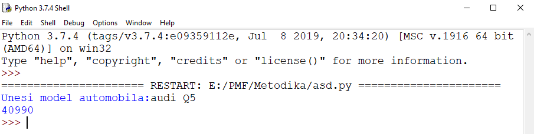
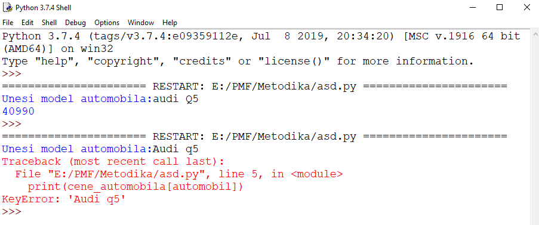
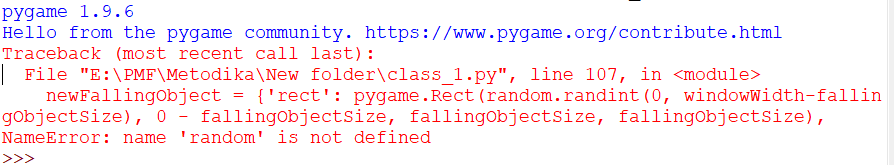

# Faza 2

***Autor: Đorđe Marinković***

---

## Čas 3

Dobrodošli na treći čas druge faze!

Na ovom času ćete naučiti:

- Šta su to rečnici  
- Kako implementirati kretanje virusa
- Kako implementirati koliziju između junaka i virusa

---

### Rečnici 

Organzaciju podataka u pygame-u možemo vršiti pomoću listi, niski, torki, skupova i rečnika.

Rečnike u pygame-u koristimo kada podatke organizujemo kao ključ i njena vrednost.

Definicija rečnika:

```
ime_recnika = { 'kljuc1' : vrednost1,
                'kljuc2' : vrednost2,
                ... }
```

* Ključ moramo unositi pod jednostrukim(```' '```) ili  dvostrukim(```" "```) navodnicima, dok vrednost unosimo bez njih.

Funkcionalnost rečnika ćemo najlakse razumeti na konkretnom primeru.

Primer:

Ispisivanje vrednosti vozila na osnovu modela.

Kod:

```python
cene_automobila = {"bmw 320": 35990,
                   "mercedes-benz slk": 44650,
                   "audi Q5": 40990}
automobil = input("Unesi model automobila:")
print(cene_automobila[automobil])

```
Slika:



Napomena:

* Prilikom testiranja moramo voditi računa da ključ bude jedinstven i tačno naveden kao u inicijalizaciji, jer je pyton case sensitivity jezik i prepoznaje razliku između malih i velikih slova

Slika:



---

## Kretanje virusa

Implementaciju kretanja virusa ćemo ostvariti pomoću ``` pygame.Rect ``` obejkta, funkcijama nad njima, listama, rečnicima i konstantana koje ćemo morati da uvedemo u naš projekat.

Funkcije:

``` pygame.Rect.move_ip(x,y)```

* funkcija pomera naš pravougaonik u prozoru
* funkcij ima dva parametra, koordinate x i y

Liste:

* kako naša igrica ima vise virusa koji se kreću moraćemo da uvedemo listu virusa

``` fallingObjects = [] ```

Rečnik:

* uvodimo i rečnik sa tri ključa, preko kojih ćemo pristupati našim virusima u listi

```python
newFallingObject = {'rect': value,
                    'speed': value,
                    'surface':value
                    }
 ```

Konstante:

* uvodimo konstante za minimalnu i maksimalnu brzinu jer želimo da nam se virusi kreću različitim brzinama
* konstantu za veličinu virusa
* konstantu koja će nam određivati brzinu kreiranj novih virusa( što veći broj stavimo za konstantu ``` fallingObjectsCreateRate ``` kreiranje novih virusa će biti sporije)

```python
fallingObjectSize = 30
fallingObjectMinSpeed = 1
fallingObjectMaxSpeed = 8
fallingObjectCreationRate = 1

 ```

Kod koji dodajemo u naš projekrat za kretanje virusa izgleda ovako:

```python
# dodavanje novog virusa na početak prozora
baddieAddCounter +=1
if baddieAddCounter == fallingObjectCreationRate:
    newFallingObject = {'rect': pygame.Rect(random.randint(0, windowWidth-fallingObjectSize), 0 - fallingObjectSize, fallingObjectSize, fallingObjectSize),
                        'speed': random.randint(fallingObjectMinSpeed, fallingObjectMaxSpeed),
                        'surface':pygame.transform.scale(fallingObjectImage, (fallingObjectSize, fallingObjectSize)),
                                }

    fallingObjects.append(newFallingObject)
 ```
* na početku proveramo da li je borj prolaska kroz ```while``` petlju jednak brzini kreiranja virusa ako jeste kreirano novi virus()

 * prvo u našu listu ``` fallingObjects = [] ``` dodajemo rečnike koji sadrže tri ključa(rect, speed, sufrace)
 
 * rect ključ će nam davati nasumičan položaj našeg lika

 * speed ključ će nam davati nasumičnu brzinu, jer ne želimo da nam se svi virusi kreću istom brzinom

 * surface ključ će nam davati veličinu samog virusa

Napomena:

* zbog korišćenja ``` random ``` ugrađene funkcije, moramo je uključiti(importovati) na samom počeku našeg koda ``` import random ``` u suprotnom će naša konzola prijaviti grešku.

Slika greške:



Sada naš kod izgleda:

```python
import pygame, sys, random
from pygame.locals import *

backgroundColor = (255, 255, 255)

# izolovanje dimenzija
(windowWidth, windowHeight) = (500, 300)

background = pygame.image.load('bg.png')
# skaliranje na željenu dimenziju
background = pygame.transform.scale(background, (windowWidth, windowHeight))

playerMoveRate = 5

def terminate():
    pygame.quit()
    sys.exit()

# inicijalizacija pygame-a
pygame.init()

# podešavanja prozora
windowSurface = pygame.display.set_mode((windowWidth, windowHeight))

# postavljanje naslova prozora
pygame.display.set_caption('Neo i virusi')
pygame.mouse.set_visible(False)

# slika junaka
playerImage = pygame.image.load('neo.png')
playerDimensions = (30, 70)
playerImage = pygame.transform.scale(playerImage, playerDimensions)
playerRect = playerImage.get_rect()

# podešavanje pozicije pravougaonika koji okružuje junaka
playerRect.topleft = (int(windowWidth / 2) - int(playerDimensions[0] / 2), windowHeight - playerDimensions[1])

# padajući objekti (virusi)
fallingObjectImage = pygame.image.load('object.png')
fallingObjectDimensions = (96, 80)
fallingObjectImage = pygame.transform.scale(fallingObjectImage, fallingObjectDimensions)
fallingObjectRect = fallingObjectImage.get_rect()

pygame.display.update()

# konstante
fallingObjectSize = 30
fallingObjectMinSpeed = 1
fallingObjectMaxSpeed = 8
fallingObjectCreationRate = 6

while True:
    playerRect.topleft = (int(windowWidth / 2), int(windowHeight - 50))
    moveLeft = moveRight = moveUp = moveDown = False
    fallingObjects = []
    baddieAddCounter = 0
    
    while True:
        for event in pygame.event.get():
            if event.type == QUIT:
                terminate()

            if event.type == KEYDOWN:
                # pritisnuto dugme a
                if event.key == K_LEFT or event.key == ord('a'):
                    moveLeft = True

                # pritisnuto dugme d
                if event.key == K_RIGHT or event.key == ord('d'):
                    moveRight = True

                # pritisnuto dugme w
                if event.key == K_UP or event.key == ord('w'):
                    moveUp = True

                # pritisnuto dugme s
                if event.key == K_DOWN or event.key == ord('s'):
                    moveDown = True

            if event.type == KEYUP:
                if event.key == K_ESCAPE:
                    terminate()

                if event.key == K_LEFT or event.key == ord('a'):
                    moveLeft = False

                if event.key == K_RIGHT or event.key == ord('d'):
                    moveRight = False

                if event.key == K_UP or event.key == ord('w'):
                    moveUp = False

                if event.key == K_DOWN or event.key == ord('s'):
                    moveDown = False

            if event.type == MOUSEMOTION:
                playerRect.move_ip(event.pos[0] - playerRect.centerx, event.pos[1] - playerRect.centery)

        # dodavanje novog virusa na početak prozora
        baddieAddCounter +=1
        if baddieAddCounter == fallingObjectCreationRate:
            baddieAddCounter = 0
            newFallingObject = {'rect': pygame.Rect(random.randint(0, windowWidth-fallingObjectSize), 0 - fallingObjectSize, fallingObjectSize, fallingObjectSize),
                                'speed': random.randint(fallingObjectMinSpeed, fallingObjectMaxSpeed),
                                'surface':pygame.transform.scale(fallingObjectImage, (fallingObjectSize, fallingObjectSize)),
                                }

            fallingObjects.append(newFallingObject)


        # kretanje junaka
        if moveLeft and playerRect.left > 0:
            playerRect.move_ip(-1 * playerMoveRate, 0)
        if moveRight and playerRect.right < windowWidth:
            playerRect.move_ip(playerMoveRate, 0)
        if moveUp and playerRect.top > 0:
            playerRect.move_ip(0, -1 * playerMoveRate)
        if moveDown and playerRect.bottom < windowHeight:
            playerRect.move_ip(0, playerMoveRate)

        pygame.mouse.set_pos(playerRect.centerx, playerRect.centery)

        # dodavanje pozadine
        windowSurface.blit(background, (0, 0))
        
        for i in range(3):
            fallingObjectRect.topleft = (int(windowWidth / 2) + (i - 1) * fallingObjectDimensions[0]  - int(fallingObjectDimensions[0] / 2), int(windowHeight / 2) - fallingObjectDimensions[1])
            windowSurface.blit(fallingObjectImage, fallingObjectRect)

        # dodavanje junaka
        windowSurface.blit(playerImage, playerRect)

        pygame.display.update()

 ```

Zatim moramo da iscrtamo naše viruse. 

Našu ```for``` petlju za iscrtavanje likova ćemo zameniti ```for``` petljom kojom ćemo prolaziti kroz listu virusa.

Za to ćemo koristiti sledeći kod:

```python
# dodavanje padajućih junaka(virusa)
for b in fallingObjects:
    windowSurface.blit(b['surface'], b['rect'])
            
 ```

 * u ovom delu koda prolazimo kroz listu virusa i iscrtavamo svaki virus naredbom ``` windowSurface.blit()``` 

Međutim dodavanje naših rečnika u listu virusa i iscrtavanje nije dovoljno da bi se naši virusi pokrenuli, moramo dodati i sledeći kod:

```python
# kretanje padajućih junaka(virusa)
for b in fallingObjects:
    b['rect'].move_ip(0, b['speed'])
            
 ```

 * u ovom delu koda prolazimo kroz našu listu virusa i za svaki virus naredbom ``` b['rect']``` uzimamo njegov trenutni položaj u prozoru, a naredbom ``` move_ip``` pomeramo do narednog položaja zadavanjem samo y kordinate jer se naš virus pomera na dole u odnosu na trenutnu položaj

Dodaćemo i deo koda u kojim brišemo virus koji dođe do kraja prozora:

```python
 # brisanje padajućih junaka(virusa)
for b in fallingObjects[:]:
    if b['rect'].top > windowHeight:
        fallingObjects.remove(b)
            
 ```
Sada naš kod izgleda:

```python
 import pygame, sys, random
from pygame.locals import *

backgroundColor = (255, 255, 255)

# izolovanje dimenzija
(windowWidth, windowHeight) = (500, 300)

background = pygame.image.load('bg.png')
# skaliranje na željenu dimenziju
background = pygame.transform.scale(background, (windowWidth, windowHeight))

playerMoveRate = 5

def terminate():
    pygame.quit()
    sys.exit()

# inicijalizacija pygame-a
pygame.init()

# podešavanja prozora
windowSurface = pygame.display.set_mode((windowWidth, windowHeight))

# postavljanje naslova prozora
pygame.display.set_caption('Neo i virusi')
pygame.mouse.set_visible(False)

# slika junaka
playerImage = pygame.image.load('neo.png')
playerDimensions = (30, 70)
playerImage = pygame.transform.scale(playerImage, playerDimensions)
playerRect = playerImage.get_rect()

# podešavanje pozicije pravougaonika koji okružuje junaka
playerRect.topleft = (int(windowWidth / 2) - int(playerDimensions[0] / 2), windowHeight - playerDimensions[1])

# padajući objekti (virusi)
fallingObjectImage = pygame.image.load('object.png')
fallingObjectDimensions = (96, 80)
fallingObjectImage = pygame.transform.scale(fallingObjectImage, fallingObjectDimensions)
fallingObjectRect = fallingObjectImage.get_rect()

pygame.display.update()

# konstante
fallingObjectSize = 30
fallingObjectMinSpeed = 1
fallingObjectMaxSpeed = 8
fallingObjectCreationRate = 6
framesPerSecond = 100

mainClock = pygame.time.Clock()

while True:
    playerRect.topleft = (int(windowWidth / 2), int(windowHeight - 50))
    moveLeft = moveRight = moveUp = moveDown = False
    fallingObjects = []
    baddieAddCounter = 0
    
    while True:
        for event in pygame.event.get():
            if event.type == QUIT:
                terminate()

            if event.type == KEYDOWN:
                # pritisnuto dugme a
                if event.key == K_LEFT or event.key == ord('a'):
                    moveLeft = True

                # pritisnuto dugme d
                if event.key == K_RIGHT or event.key == ord('d'):
                    moveRight = True

                # pritisnuto dugme w
                if event.key == K_UP or event.key == ord('w'):
                    moveUp = True

                # pritisnuto dugme s
                if event.key == K_DOWN or event.key == ord('s'):
                    moveDown = True

            if event.type == KEYUP:
                if event.key == K_ESCAPE:
                    terminate()

                if event.key == K_LEFT or event.key == ord('a'):
                    moveLeft = False

                if event.key == K_RIGHT or event.key == ord('d'):
                    moveRight = False

                if event.key == K_UP or event.key == ord('w'):
                    moveUp = False

                if event.key == K_DOWN or event.key == ord('s'):
                    moveDown = False

            if event.type == MOUSEMOTION:
                playerRect.move_ip(event.pos[0] - playerRect.centerx, event.pos[1] - playerRect.centery)

        # dodavanje novog virusa na početak prozora
        baddieAddCounter +=1
        if baddieAddCounter == fallingObjectCreationRate:
            baddieAddCounter = 0
            newFallingObject = {'rect': pygame.Rect(random.randint(0, windowWidth-fallingObjectSize), 0 - fallingObjectSize, fallingObjectSize, fallingObjectSize),
                                'speed': random.randint(fallingObjectMinSpeed, fallingObjectMaxSpeed),
                                'surface':pygame.transform.scale(fallingObjectImage, (fallingObjectSize, fallingObjectSize)),
                                }

            fallingObjects.append(newFallingObject)


        # kretanje junaka
        if moveLeft and playerRect.left > 0:
            playerRect.move_ip(-1 * playerMoveRate, 0)
        if moveRight and playerRect.right < windowWidth:
            playerRect.move_ip(playerMoveRate, 0)
        if moveUp and playerRect.top > 0:
            playerRect.move_ip(0, -1 * playerMoveRate)
        if moveDown and playerRect.bottom < windowHeight:
            playerRect.move_ip(0, playerMoveRate)

        pygame.mouse.set_pos(playerRect.centerx, playerRect.centery)

        # dodavanje pozadine
        windowSurface.blit(background, (0, 0))

        # dodavanje junaka
        windowSurface.blit(playerImage, playerRect)

        # dodavanje padajućih junaka(virusa)
        for b in fallingObjects:
            windowSurface.blit(b['surface'], b['rect'])

        # kretanje padajućih junaka(virusa)
        for b in fallingObjects:
            b['rect'].move_ip(0, b['speed'])
                  
        # brisanje padajućih junaka(virusa)
        for b in fallingObjects[:]:
            if b['rect'].top > windowHeight:
                fallingObjects.remove(b)

        pygame.display.update()
        mainClock.tick(framesPerSecond)
       
    pygame.display.update()         
 ```

Napomena:

* delovi koda ```# dodavanje padajućih objekta(virusa)```, ```# # kretanje padajućih junaka(virusa) ``` i ``` # brisanje padajućihjunaka(virusa)```, moraju ići iza ``` # dodavanje pozadine``` i ```# dodavanje junaka``` inače naš kod neće raditi kako treba

---

## Kolizija likova

Koliziju likova implementiraćemo funkcijom.

```python
def collided(playerRect, fallingObjects): 
    for b in fallingObjects:
        if playerRect.colliderect(b['rect']):
            return True
    return False         
 ```

 * u ovoj funkciji prolazimo kroz listu virusa i koristeći ugrađenu funkciju ```colliderect()``` proveravamo da li se dva pravougaonika poklapaju(tj da li se naši likovi dodiruju)

Funckiju ćemo pozivati na kraju našeg koda:

```python
 # kraj igre
        if collided(playerRect, fallingObjects):
            break      
 ```

 * ako su dva lika u koliziji izlazimo iz petlje i zaustavićemo našu igru na 5 sekundi

 Zaustavljanje igre na 5 sekundi ćemo ostaviriti pomoću naredbe

```python
pygame.time.wait(5000)
 ```

* kao parametar funkcije unosimo vrednost u milisekundama

Naš kod sad izgleda:

```python
 import pygame, sys, random
from pygame.locals import *

backgroundColor = (255, 255, 255)

# izolovanje dimenzija
(windowWidth, windowHeight) = (500, 300)

background = pygame.image.load('bg.png')
# skaliranje na željenu dimenziju
background = pygame.transform.scale(background, (windowWidth, windowHeight))

playerMoveRate = 5

def terminate():
    pygame.quit()
    sys.exit()

def collided(playerRect, fallingObjects): 
    for b in fallingObjects:
        if playerRect.colliderect(b['rect']):
            return True
    return False    

# inicijalizacija pygame-a
pygame.init()

# podešavanja prozora
windowSurface = pygame.display.set_mode((windowWidth, windowHeight))

# postavljanje naslova prozora
pygame.display.set_caption('Neo i virusi')
pygame.mouse.set_visible(False)

# slika junaka
playerImage = pygame.image.load('neo.png')
playerDimensions = (30, 70)
playerImage = pygame.transform.scale(playerImage, playerDimensions)
playerRect = playerImage.get_rect()

# podešavanje pozicije pravougaonika koji okružuje junaka
playerRect.topleft = (int(windowWidth / 2) - int(playerDimensions[0] / 2), windowHeight - playerDimensions[1])

# padajući objekti (virusi)
fallingObjectImage = pygame.image.load('object.png')
fallingObjectDimensions = (96, 80)
fallingObjectImage = pygame.transform.scale(fallingObjectImage, fallingObjectDimensions)
fallingObjectRect = fallingObjectImage.get_rect()

pygame.display.update()

# konstante
fallingObjectSize = 30
fallingObjectMinSpeed = 1
fallingObjectMaxSpeed = 8
fallingObjectCreationRate = 6
framesPerSecond = 100

mainClock = pygame.time.Clock()

while True:
    playerRect.topleft = (int(windowWidth / 2), int(windowHeight - 50))
    moveLeft = moveRight = moveUp = moveDown = False
    fallingObjects = []
    baddieAddCounter = 0
    
    while True:
        for event in pygame.event.get():
            if event.type == QUIT:
                terminate()

            if event.type == KEYDOWN:
                # pritisnuto dugme a
                if event.key == K_LEFT or event.key == ord('a'):
                    moveLeft = True

                # pritisnuto dugme d
                if event.key == K_RIGHT or event.key == ord('d'):
                    moveRight = True

                # pritisnuto dugme w
                if event.key == K_UP or event.key == ord('w'):
                    moveUp = True

                # pritisnuto dugme s
                if event.key == K_DOWN or event.key == ord('s'):
                    moveDown = True

            if event.type == KEYUP:
                if event.key == K_ESCAPE:
                    terminate()

                if event.key == K_LEFT or event.key == ord('a'):
                    moveLeft = False

                if event.key == K_RIGHT or event.key == ord('d'):
                    moveRight = False

                if event.key == K_UP or event.key == ord('w'):
                    moveUp = False

                if event.key == K_DOWN or event.key == ord('s'):
                    moveDown = False

            if event.type == MOUSEMOTION:
                playerRect.move_ip(event.pos[0] - playerRect.centerx, event.pos[1] - playerRect.centery)

        # dodavanje novog virusa na početak prozora
        baddieAddCounter +=1
        if baddieAddCounter == fallingObjectCreationRate:
            baddieAddCounter = 0
            newFallingObject = {'rect': pygame.Rect(random.randint(0, windowWidth-fallingObjectSize), 0 - fallingObjectSize, fallingObjectSize, fallingObjectSize),
                                'speed': random.randint(fallingObjectMinSpeed, fallingObjectMaxSpeed),
                                'surface':pygame.transform.scale(fallingObjectImage, (fallingObjectSize, fallingObjectSize)),
                                }

            fallingObjects.append(newFallingObject)


        # kretanje junaka
        if moveLeft and playerRect.left > 0:
            playerRect.move_ip(-1 * playerMoveRate, 0)
        if moveRight and playerRect.right < windowWidth:
            playerRect.move_ip(playerMoveRate, 0)
        if moveUp and playerRect.top > 0:
            playerRect.move_ip(0, -1 * playerMoveRate)
        if moveDown and playerRect.bottom < windowHeight:
            playerRect.move_ip(0, playerMoveRate)

        pygame.mouse.set_pos(playerRect.centerx, playerRect.centery)

        # dodavanje pozadine
        windowSurface.blit(background, (0, 0))

        # dodavanje junaka
        windowSurface.blit(playerImage, playerRect)

        # dodavanje padajućih junaka(virusa)
        for b in fallingObjects:
            windowSurface.blit(b['surface'], b['rect'])

        # kretanje padajućih junaka(virusa)
        for b in fallingObjects:
            b['rect'].move_ip(0, b['speed'])
                  
        # brisanje padajućih junaka(virusa)
        for b in fallingObjects[:]:
            if b['rect'].top > windowHeight:
                fallingObjects.remove(b)

        # kraj igre
        if collided(playerRect, fallingObjects):
            break

        pygame.display.update()
        mainClock.tick(framesPerSecond)
       

    pygame.time.wait(5000)
    pygame.display.update()

 ```
 
