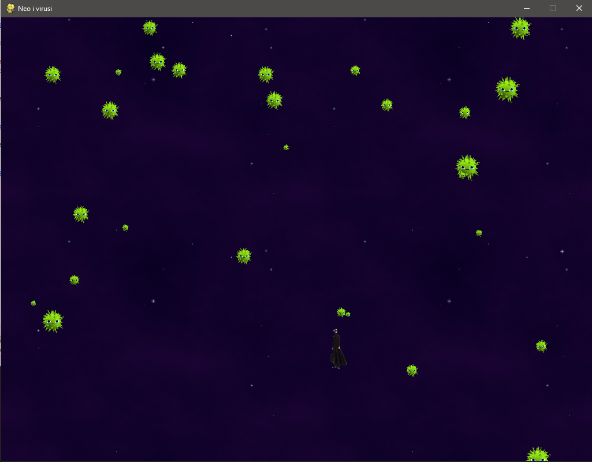
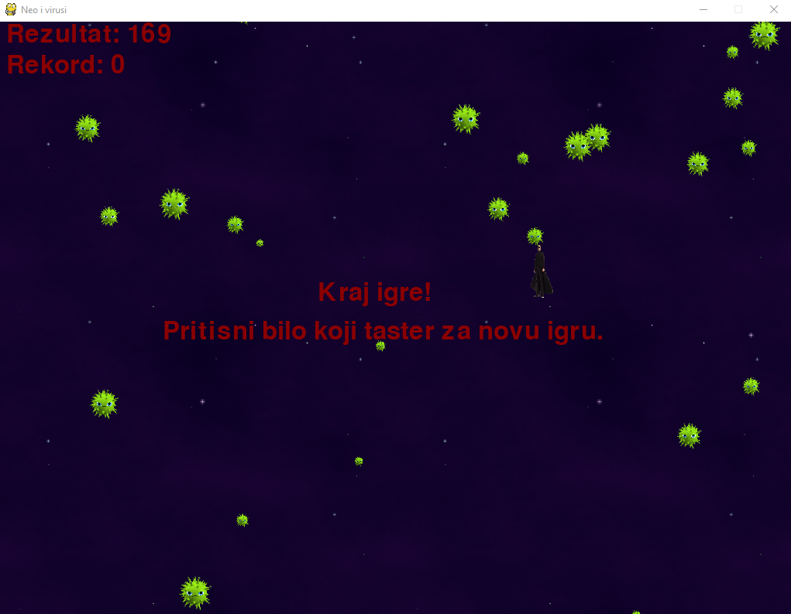
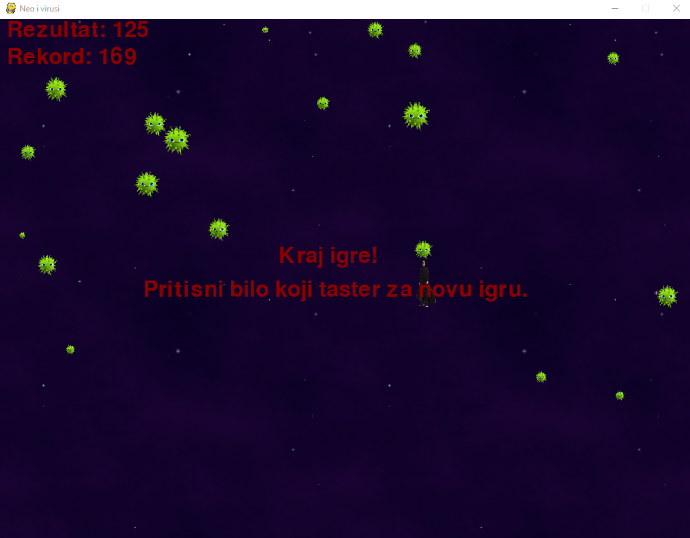

# Faza 3

**_Autor: Andrija Cvetković_**

---

## Čas 1

Dobrodošli na prvi čas treće (poslednje) faze!

Na ovom času ćete naučiti:

- Kako da padajući objekti (virusi) budu različiti
- Kako se kreira uvodna poruka u igrici
- Kako se kreira poruka kraja igrice (Game Over)
- Kako se kreira praćenje rezultata (i rekorda)
- Kako se dodaje muzika
- Kako usporiti padajuće objekte
- Kako da padajući objekti promene smer kretanja
- Kako da ubrzamo/usporimo vreme u igrici

---

### Kako da padajući objekti (virusi) budu različiti

Igrica koju imamo nakon prethodnog časa već može da se igra ali nije naodmet proširiti njene funkcionalnosti.

Prvi korak: _padajući objekti (virusi) različitih dimenzija._

Trenutna verzija našeg koda ima sledeće konstante vezane za osobine padajućih objakata (virusa):

```python
fallingObjectSize = 30
fallingObjectMinSpeed = 1
fallingObjectMaxSpeed = 8
fallingObjectCreationRate = 6
```

Deklarišimo dve promenljive koje će biti donja i gornja granica veličine padajućih objekata.

```python
fallingObjectMinSize = 10
fallingObjectMaxSize = 50
```

Sada, u bloku koda u kojem postavljamo osobine padajućih objekata, dodajemo ove dve konstante.

```python
if fallingObjectCounter == fallingObjectCreationRate:
    fallingObjectCounter = 0
    fallingObjectRandomSize = random.randint(fallingObjectMinSize, fallingObjectMaxSize)
    newFallingObject = {
                'rect': pygame.Rect(random.randint(0, windowWidth - fallingObjectRandomSize), 0 - fallingObjectRandomSize, fallingObjectRandomSize, fallingObjectRandomSize),
                'speed': random.randint(fallingObjectMinSpeed, fallingObjectMaxSpeed),
                'surface':pygame.transform.scale(fallingObjectImage, (fallingObjectRandomSize, fallingObjectRandomSize)),
                }
```

Igrica sada izgleda ovako:



A kod ovako:

```python
import pygame, sys, random
from pygame.locals import *

# izolovanje dimenzija
(windowWidth, windowHeight) = (1024, 768)

background = pygame.image.load('bg.png')
# skaliranje na željenu dimenziju
background = pygame.transform.scale(background, (windowWidth, windowHeight))

playerMoveRate = 5

def terminate():
    pygame.quit()
    sys.exit()

def collided(playerRect, fallingObjects):
    for fallingObject in fallingObjects:
        if playerRect.colliderect(fallingObject['rect']):
            return True
    return False

# inicijalizacija pygame-a
pygame.init()

# podešavanja prozora
windowSurface = pygame.display.set_mode((windowWidth, windowHeight))

# postavljanje naslova prozora
pygame.display.set_caption('Neo i virusi')
pygame.mouse.set_visible(False)

# slika junaka
playerImage = pygame.image.load('neo.png')
playerDimensions = (30, 70)
playerImage = pygame.transform.scale(playerImage, playerDimensions)
playerRect = playerImage.get_rect()

# podešavanje pozicije pravougaonika koji okružuje junaka
playerRect.topleft = (int(windowWidth / 2) - int(playerDimensions[0] / 2), windowHeight - playerDimensions[1])

# padajući objekti (virusi)
fallingObjectImage = pygame.image.load('object.png')
fallingObjectDimensions = (96, 80)
fallingObjectImage = pygame.transform.scale(fallingObjectImage, fallingObjectDimensions)
fallingObjectRect = fallingObjectImage.get_rect()

pygame.display.update()

# konstante
### NOVI KOD POČETAK ###
fallingObjectMinSize = 10
fallingObjectMaxSize = 50
### NOVI KOD KRAJ ###
fallingObjectMinSpeed = 1
fallingObjectMaxSpeed = 8
fallingObjectCreationRate = 6
framesPerSecond = 100

mainClock = pygame.time.Clock()

while True:
    playerRect.topleft = (int(windowWidth / 2), int(windowHeight - 50))
    moveLeft = moveRight = moveUp = moveDown = False
    fallingObjects = []
    fallingObjectCounter = 0

    while True:
        for event in pygame.event.get():
            # pritisnuto dugme na tastaturi
            if event.type == KEYDOWN:
                # leva strelica ili dugme A
                if event.key == K_LEFT or event.key == ord('a'):
                    moveLeft = True

                if event.key == K_RIGHT or event.key == ord('d'):
                    moveRight = True

                if event.key == K_UP or event.key == ord('w'):
                    moveUp = True

                if event.key == K_DOWN or event.key == ord('s'):
                    moveDown = True

            # otpušteno dugme sa tastature
            if event.type == KEYUP:
                if event.key == K_ESCAPE:
                        terminate()
                if event.key == K_LEFT or event.key == ord('a'):
                    moveLeft = False
                if event.key == K_RIGHT or event.key == ord('d'):
                    moveRight = False
                if event.key == K_UP or event.key == ord('w'):
                    moveUp = False
                if event.key == K_DOWN or event.key == ord('s'):
                    moveDown = False

            # pomeraj miša
            if event.type == MOUSEMOTION:
                playerRect.move_ip(event.pos[0] - playerRect.centerx, event.pos[1] - playerRect.centery)

            # klik na X dugme prozora
            if event.type == QUIT:
                terminate()

        # dodavanje novog virusa na početak prozora
        fallingObjectCounter +=1
        if fallingObjectCounter == fallingObjectCreationRate:
            fallingObjectCounter = 0
            ### NOVI KOD POČETAK ###
            fallingObjectRandomSize = random.randint(fallingObjectMinSize, fallingObjectMaxSize)
            newFallingObject = {
                        'rect': pygame.Rect(random.randint(0, windowWidth - fallingObjectRandomSize), 0 - fallingObjectRandomSize, fallingObjectRandomSize, fallingObjectRandomSize),
                        'speed': random.randint(fallingObjectMinSpeed, fallingObjectMaxSpeed),
                        'surface':pygame.transform.scale(fallingObjectImage, (fallingObjectRandomSize, fallingObjectRandomSize)),
                        }
            ### NOVI KOD KRAJ ###

            fallingObjects.append(newFallingObject)


        # pomeranje junaka
        if moveLeft and playerRect.left > 0:
            playerRect.move_ip(-1 * playerMoveRate, 0)
        if moveRight and playerRect.right < windowWidth:
            playerRect.move_ip(playerMoveRate, 0)
        if moveUp and playerRect.top > 0:
            playerRect.move_ip(0, -1 * playerMoveRate)
        if moveDown and playerRect.bottom < windowHeight:
            playerRect.move_ip(0, playerMoveRate)

        pygame.mouse.set_pos(playerRect.centerx, playerRect.centery)

        # dodavanje pozadine
        windowSurface.blit(background, (0, 0))

        # dodavanje junaka
        windowSurface.blit(playerImage, playerRect)

        # dodavanje padajućih objekata (virusa)
        for fallingObject in fallingObjects:
            windowSurface.blit(fallingObject['surface'], fallingObject['rect'])

        # kretanje padajućih objekata (virusa)
        for fallingObject in fallingObjects:
            fallingObject['rect'].move_ip(0, fallingObject['speed'])

        # brisanje padajućih objekata (virusa)
        for fallingObject in fallingObjects[:]:
            if fallingObject['rect'].top > windowHeight:
                fallingObjects.remove(fallingObject)

        # kraj igre
        if collided(playerRect, fallingObjects):
            break

        pygame.display.update()
        mainClock.tick(framesPerSecond)

    pygame.time.wait(5000)
    pygame.display.update()
```

---

### Kako se:

- kreira uvodna poruka u igrici
- kreira poruka kraja igrice (Game Over)
- kreira praćenje rezultata (i rekorda)

Sledeći korak, dodavanje teksta!

```python
def drawText(text, font, surface, x, y):
    textObject = font.render(text, 1, textColor)
    textRect = textObject.get_rect()
    textRect.topleft = (x, y)
    surface.blit(textObject, textRect)
```

Obzirom da ćemo na više mesta prikazivati tekst u igrici, definišemo funkciju koja nam olakšava posao.

Gore navedena funkcija kreira tekst objekat, pozicionira ga na prosleđene (x, y) koordinate i vezuje za prosleđenu površinu (što će kod nas uvek biti površina glavnog prozora).

Kako python izvršava liniju po liniju, bez čekanja, potrebna nam je funkcija koja će "zaključati" igricu na neki način.

Neka ta funkcija izgleda ovako:

```python
def waitForPlayerToPressKey():
    while True:
        for event in pygame.event.get():
            if event.type == QUIT:
                terminate()
            if event.type == KEYDOWN:
                if event.key == K_ESCAPE:
                    terminate()
                return
```

Zadržavamo funkcionalnost gašenja igrice klikom na X prozora ili ESC dugme tastasture a dodajemo "beskonačnu" petlju koja će se zaustaviti onog trenutka kad igrač pritisne bilo koje dugme tastature osim ESC dugmeta.

Pomoću ovih dveju funkcija možemo implementirati uvodnu i zaključnu (game over) poruku.

Uvodna poruka:

```python
drawText('Koristi miša ili strelice kako bi izbegavao viruse.', font, windowSurface, (windowWidth / 2) - 300, (windowHeight / 2) - 50)
drawText('Pritisni bilo koji taster za početak.', font, windowSurface, (windowWidth / 2) - 300, (windowHeight / 2))
pygame.display.update()
waitForPlayerToPressKey()
```

Zaključna (game over) poruka:

```python
drawText('Kraj igre!', font, windowSurface, (windowWidth / 2) - 100, (windowHeight / 2) - 50)
drawText('Pritisni bilo koji taster za novu igru.', font, windowSurface, (windowWidth / 2) - 300, (windowHeight / 2))
pygame.display.update()
waitForPlayerToPressKey()
```

Još je ostalo praćenje rezultata i rekorda.

```python
drawText('Rekord: %s' % (topScore), font, windowSurface, 10, 40)
drawText('Rezultat: %s' % (score), font, windowSurface, 10, 0)
```

Neka se tekstovi iscrtaju u gornjem levom uglu.

Neka `topScore` i `score` budu promenljive koje će pratiti rezultate.






Kod sada izgleda ovako:

```python
import pygame, sys, random
from pygame.locals import *

# izolovanje dimenzija
(windowWidth, windowHeight) = (1024, 768)

textColor = (139, 0, 0)

background = pygame.image.load('bg.png')
# skaliranje na željenu dimenziju
background = pygame.transform.scale(background, (windowWidth, windowHeight))

playerMoveRate = 5

def terminate():
    pygame.quit()
    sys.exit()

def collided(playerRect, fallingObjects):
    for fallingObject in fallingObjects:
        if playerRect.colliderect(fallingObject['rect']):
            return True
    return False

### NOVI KOD POČETAK ###
def drawText(text, font, surface, x, y):
    textObject = font.render(text, 1, textColor)
    textRect = textObject.get_rect()
    textRect.topleft = (x, y)
    surface.blit(textObject, textRect)

def waitForPlayerToPressKey():
    while True:
        for event in pygame.event.get():
            if event.type == QUIT:
                terminate()
            if event.type == KEYDOWN:
                if event.key == K_ESCAPE:
                    terminate()
                return
### NOVI KOD KRAJ ###

# inicijalizacija pygame-a
pygame.init()

# podešavanja prozora
windowSurface = pygame.display.set_mode((windowWidth, windowHeight))

# postavljanje naslova prozora
pygame.display.set_caption('Neo i virusi')
pygame.mouse.set_visible(False)

### NOVI KOD POČETAK ###
# font
font = pygame.font.SysFont(None, 48)

# uvodna poruka
drawText('Koristi miša ili strelice kako bi izbegavao viruse.', font, windowSurface, int(windowWidth / 2) - 300, int(windowHeight / 2) - 50)
drawText('Pritisni bilo koji taster za početak.', font, windowSurface, int(windowWidth / 2) - 300, int(windowHeight / 2))
pygame.display.update()
waitForPlayerToPressKey()
### NOVI KOD KRAJ ###

# slika junaka
playerImage = pygame.image.load('neo.png')
playerDimensions = (30, 70)
playerImage = pygame.transform.scale(playerImage, playerDimensions)
playerRect = playerImage.get_rect()

# podešavanje pozicije pravougaonika koji okružuje junaka
playerRect.topleft = (int(windowWidth / 2) - int(playerDimensions[0] / 2), windowHeight - playerDimensions[1])

# padajući objekti (virusi)
fallingObjectImage = pygame.image.load('object.png')
fallingObjectDimensions = (96, 80)
fallingObjectImage = pygame.transform.scale(fallingObjectImage, fallingObjectDimensions)
fallingObjectRect = fallingObjectImage.get_rect()

pygame.display.update()

# konstante
fallingObjectMinSize = 10
fallingObjectMaxSize = 50
fallingObjectMinSpeed = 1
fallingObjectMaxSpeed = 8
fallingObjectCreationRate = 6
framesPerSecond = 100

mainClock = pygame.time.Clock()

### NOVI KOD POČETAK ###
topScore = 0
### NOVI KOD KRAJ ###

while True:
    playerRect.topleft = (int(windowWidth / 2), int(windowHeight - 50))
    moveLeft = moveRight = moveUp = moveDown = False
    fallingObjects = []
    fallingObjectCounter = 0
    ### NOVI KOD POČETAK ###
    score = 0
    ### NOVI KOD KRAJ ###


    while True:
        ### NOVI KOD POČETAK ###
        score += 1
        ### NOVI KOD KRAJ ###

        for event in pygame.event.get():
            # pritisnuto dugme na tastaturi
            if event.type == KEYDOWN:
                # leva strelica ili dugme A
                if event.key == K_LEFT or event.key == ord('a'):
                    moveLeft = True

                if event.key == K_RIGHT or event.key == ord('d'):
                    moveRight = True

                if event.key == K_UP or event.key == ord('w'):
                    moveUp = True

                if event.key == K_DOWN or event.key == ord('s'):
                    moveDown = True

            # otpušteno dugme sa tastature
            if event.type == KEYUP:
                if event.key == K_ESCAPE:
                        terminate()
                if event.key == K_LEFT or event.key == ord('a'):
                    moveLeft = False
                if event.key == K_RIGHT or event.key == ord('d'):
                    moveRight = False
                if event.key == K_UP or event.key == ord('w'):
                    moveUp = False
                if event.key == K_DOWN or event.key == ord('s'):
                    moveDown = False

            # pomeraj miša
            if event.type == MOUSEMOTION:
                playerRect.move_ip(event.pos[0] - playerRect.centerx, event.pos[1] - playerRect.centery)

            # klik na X dugme prozora
            if event.type == QUIT:
                terminate()

        # dodavanje novog virusa na početak prozora
        fallingObjectCounter +=1
        if fallingObjectCounter == fallingObjectCreationRate:
            fallingObjectCounter = 0
            fallingObjectRandomSize = random.randint(fallingObjectMinSize, fallingObjectMaxSize)
            newFallingObject = {
                        'rect': pygame.Rect(random.randint(0, windowWidth - fallingObjectRandomSize), 0 - fallingObjectRandomSize, fallingObjectRandomSize, fallingObjectRandomSize),
                        'speed': random.randint(fallingObjectMinSpeed, fallingObjectMaxSpeed),
                        'surface':pygame.transform.scale(fallingObjectImage, (fallingObjectRandomSize, fallingObjectRandomSize)),
                        }

            fallingObjects.append(newFallingObject)

        # pomeranje junaka
        if moveLeft and playerRect.left > 0:
            playerRect.move_ip(-1 * playerMoveRate, 0)
        if moveRight and playerRect.right < windowWidth:
            playerRect.move_ip(playerMoveRate, 0)
        if moveUp and playerRect.top > 0:
            playerRect.move_ip(0, -1 * playerMoveRate)
        if moveDown and playerRect.bottom < windowHeight:
            playerRect.move_ip(0, playerMoveRate)

        pygame.mouse.set_pos(playerRect.centerx, playerRect.centery)

        # dodavanje pozadine
        windowSurface.blit(background, (0, 0))

        # dodavanje junaka
        windowSurface.blit(playerImage, playerRect)

        # dodavanje padajućih objekata (virusa)
        for fallingObject in fallingObjects:
            windowSurface.blit(fallingObject['surface'], fallingObject['rect'])

        # kretanje padajućih objekata (virusa)
        for fallingObject in fallingObjects:
            fallingObject['rect'].move_ip(0, fallingObject['speed'])

        # brisanje padajućih objekata (virusa)
        for fallingObject in fallingObjects[:]:
            if fallingObject['rect'].top > windowHeight:
                fallingObjects.remove(fallingObject)

        ### NOVI KOD POČETAK ###
        # crtanje razultata
        drawText('Rekord: %s' % (topScore), font, windowSurface, 10, 40)
        drawText('Rezultat: %s' % (score), font, windowSurface, 10, 0)

        # kraj igre
        if collided(playerRect, fallingObjects):
            if score > topScore:
                topScore = score
            break
        ### NOVI KOD KRAJ ###

        pygame.display.update()
        mainClock.tick(framesPerSecond)

    ### NOVI KOD POČETAK ###
    drawText('Kraj igre!', font, windowSurface, int(windowWidth / 2) - 100, int(windowHeight / 2) - 50)
    drawText('Pritisni bilo koji taster za novu igru.', font, windowSurface, int(windowWidth / 2) - 300, int(windowHeight / 2))
    pygame.display.update()
    waitForPlayerToPressKey()
    ### NOVI KOD KRAJ ###
```

---

### Poslednje tri stavke:

- Kako se dodaje muzika
- Kako usporiti padajuće objekte
- Kako da padajući objekti promene smer kretanja

Dešavalo se (a i dalje dešava) da u igrici soundtrack (kolekcija pesama/melodija) osvoji više glavnih nagrada nego sama igrica.

Muzika je od ogromnog značaja jer održava igračev fokus i nagoveštava sam tok igrice. Npr. kada igrač pobeđuje, dobija veselu/motivacionu melodiju, kada gubi dobija razočaravajuću.

U našoj igrici imaćemo pozadinsku melodiju (koja će se čuti tokom igranja) i melodiju kraja igrice (game over).

Pygame sadrži svoj mikser za melodije:

```python
gameOverSound = pygame.mixer.Sound('gameover.wav')
pygame.mixer.music.load('background.mid')
```

Učitavamo melodiju kraja i pozadinsku melodiju.

Takođe hoćemo da pozadinska melodija krene ispočetka, kada i igrica krene ispočetka:

```python
pygame.mixer.music.play(-1, 0.0)
```

Muziku zaustavljamo funkcijom:

```python
pygame.mixer.music.stop()
```

---

Kako bi igrica bila interesantnija, dodaćemo dve specijalne funkcionalnosti. Usporavanje padajućih objekata i promena smera kretanja istih.

Zvaćemo ih cheat-ovima (eng. cheat = varati) jer će igraču olakšati igru kada ih iskoristi.

Deklarišemo promenljive

```python
reverseCheat = slowCheat = False
```

Sada je neophodno da odlučimo kako ćemo koristiti ove cheat-ove.

Neka to bude klikom na dugmiće tastature Q i E.

```python
if event.type == KEYDOWN:
    ...
    if event.key == ord('q'):
        reverseCheat = True
    if event.key == ord('e'):
        slowCheat = True
```

```python
if event.type == KEYUP:
    if event.key == ord('q'):
        reverseCheat = False
        score = 0
    if event.key == ord('e'):
        slowCheat = False
        score = 0
```

Igrica bi bila isuviše laka kada bi cheat-ovi mogli da se koriste bez ikakve cene. Onog trenutka kad igrač odluči da vara, rezultat mu se vraća na 0.

Finalni kod izgleda ovako:
